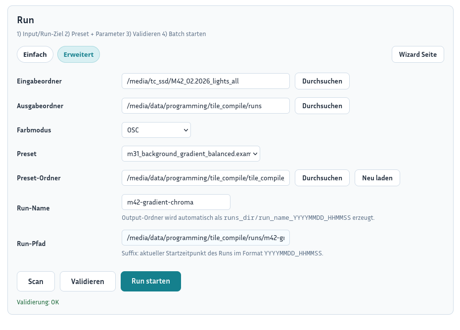
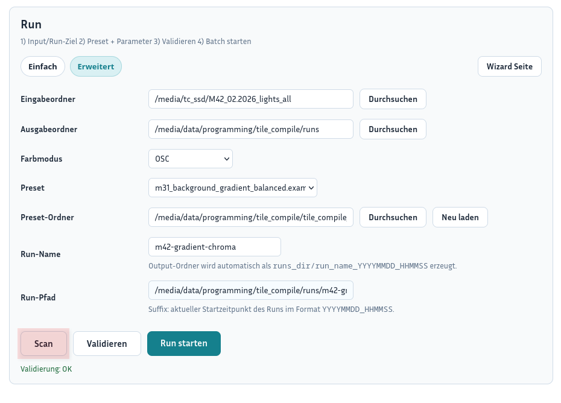
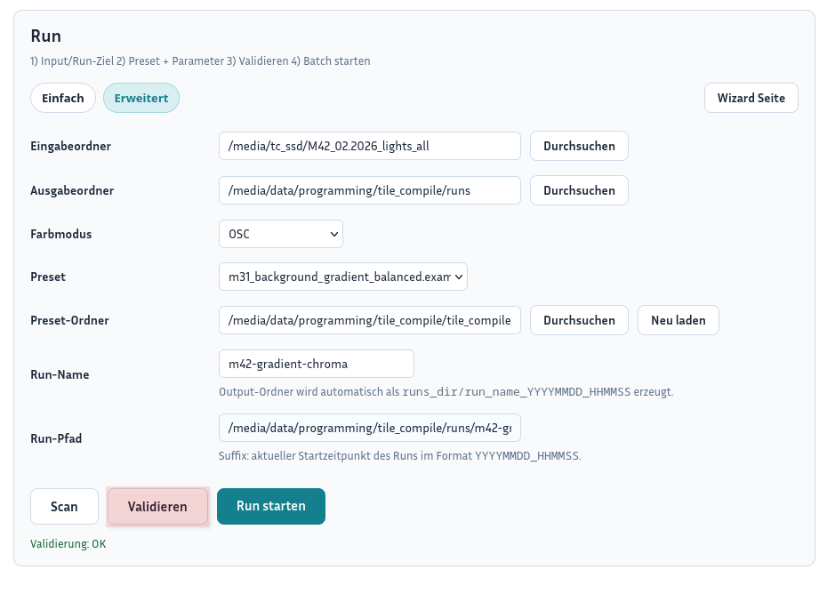
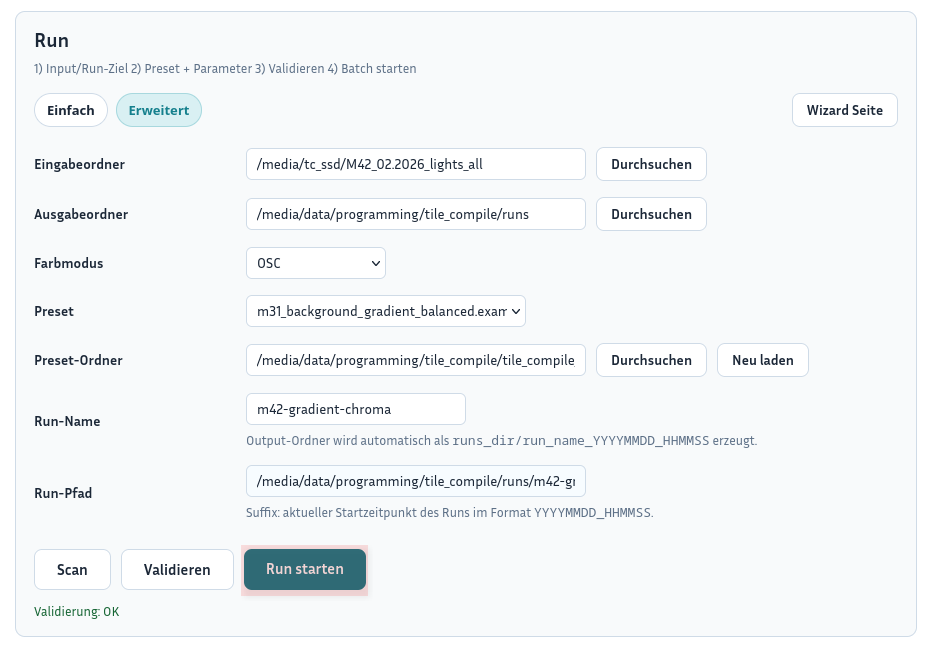

# Dashboard Run Step-by-Step

This guide describes the compact run workflow directly from the dashboard.
It focuses on the fast path:

- enter data
- run scan
- validate
- start run

## Purpose of the dashboard run

The dashboard run is the fastest entry point for starting a new run.
It happens directly on the dashboard page and uses the compact fields inside the `Guided Run` block.

Typical fields in the dashboard run are:

- `Input directories`
- `Output directory`
- `Color mode`
- `Preset`
- `Preset directory`
- `Run name`
- `Run path`

Depending on the mode, you may also see:

- `Simple`
- `Advanced`
- optional `MONO Queue`

---

## Step 1: Enter the data

### Procedure

1. Open the `Dashboard`.
2. Stay inside the `Run` block.
3. Enter the base data:
   - `Input directories`
   - `Output directory`
   - `Color mode` - is normally detected automatically from the scanned frames and only needs to be set when detection does not work
   - `Preset`
   - optional `Preset directory`
   - `Run name`
4. Check the displayed `Run path`.
5. Use `Simple` or `Advanced` mode if needed.

### Notes

- `Simple` shows only the core fields.
- `Advanced` shows additional run fields and, for `MONO`, also the queue.
- If a different preset directory is needed, use `Browse` and `Reload`.

### Result

- The run data is prepared directly on the dashboard.

---

## Step 2: Run the scan

### Procedure

1. Click `Scan`.
2. Wait until the scan has finished.
3. Review the scan status on the dashboard.
4. Confirm especially:
   - detected input data
   - plausible color mode
   - detected image data
   - warnings or errors

### Result

- The input data has been checked technically.
- The dashboard run is ready for the next step.

---

## Step 3: Validate

### Procedure

1. Click `Validate`.
2. Wait for the status below the buttons.
3. Check whether it shows `Validation: OK` or an error/warning state.
4. If errors exist, correct the data or preset first.

### Notes

- Without a successful validation, starting the run remains blocked.
- The dashboard run uses the current configuration in the background.

### Result

- The run is cleared technically and logically.

---

## Step 4: Start the run

### Procedure

1. Check once more:
   - input directories
   - output directory
   - preset
   - run name
   - run path
   - validation state
2. Click `Start Run`.
3. After a successful start, the GUI switches to `Run Monitor`.

### Important

- The start button is only enabled after validation succeeded.
- In `MONO`, advanced mode can also start a queue.

### Result

- The run was started directly from the dashboard.

---

## Short checklist for the dashboard run

- Are the `Input directories` correct?
- Is the `Output directory` correct?
- Is the `Color mode` correct?
- Was the correct `Preset` loaded?
- Is the `Run name` meaningful?
- Is the `Run path` plausible?
- Was the `Scan` successful?
- Is the `Validation` successful?
- Is `Start Run` enabled?

---
