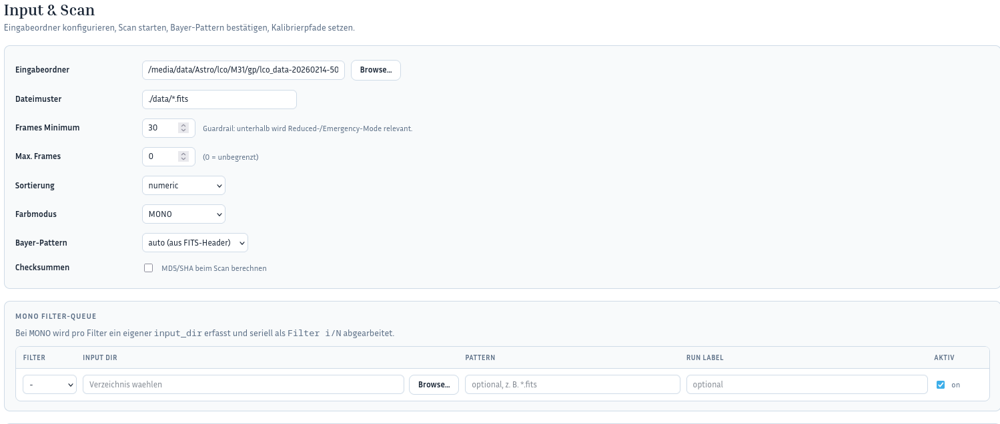

# Expert Input Step-by-Step

This guide describes the normal workflow through the GUI menu pages.
It is intended for users who want to edit inputs deliberately in the dedicated sections instead of using the guided wizard.

## Purpose of expert input

The expert workflow goes through the normal menu pages:

- `Dashboard`
- `Input & Scan`
- `Parameter Studio`
- `Run Monitor`
- optional `History + Tools`
- optional `Astrometry`
- optional `PCC`

You edit each part directly in the page intended for that purpose.

---

## Step 1: Start from the dashboard

### Procedure

1. Open the GUI and start on the `Dashboard`.
2. Check that the project context and main navigation are correct.
3. Use the menu to move into the functional areas.

### Result

- You do not start inside a guided flow.
- Navigation happens deliberately through the menu pages.

---

## Step 2: Open Input & Scan

### Procedure

1. Click `Input & Scan` in the menu.
2. Enter the base data there:
   - `Input directories`
   - `Runs Dir`
   - `Run Name`
   - `Pattern`
   - `Frames Minimum`
   - `Max. Frames`
   - `Sorting`
   - `Color mode` - is normally detected automatically from the scanned frames and only needs to be set when detection does not work
   - `Bayer pattern`
3. Check that the inputs are plausible before running the scan.

### Result

- The raw data source and the core scan parameters are set.

---

## Step 3: Maintain the optional MONO queue

This step only matters if you are working with `MONO` data.

### Procedure

1. Stay in the `Input & Scan` area.
2. Maintain the MONO queue for multiple filters.
3. Set for each row:
   - filter
   - input directory
   - optional pattern
   - optional label
4. Enable only the filters that should really be processed.

### Result

- The serial multi-filter flow is prepared.

---

## Step 4: Set calibration in the input area

### Procedure

1. Stay in `Input & Scan`.
2. Enable the required calibration types:
   - `Bias`
   - `Dark`
   - `Flat`
3. Choose for each type:
   - directory
   - master file
4. Enter the matching paths.
5. After that, run the scan and check the result.

### Result

- Inputs, queue, and calibration are prepared in the normal input flow.

---

## Step 5: Open Parameter Studio

### Procedure

1. Click `Parameter Studio` in the menu.
2. Adjust the actual processing parameters there.
3. Work with these tools as needed:
   - presets
   - search
   - scenarios
   - validation
4. Save the configuration after your changes.

### Result

- Processing parameters are maintained separately from data input.

---

## Step 6: Use Run Monitor for start and supervision

### Procedure

1. Click `Run Monitor` in the menu.
2. Start the run there with the currently prepared configuration.
3. Observe:
   - phases
   - log output
   - progress
   - artifacts
4. Generate a report from the running or completed run if needed.
5. Use resume or analysis functions later if needed.

### Result

- The run is supervised in the operational monitor instead of inside a wizard.
- Report creation is part of the normal operating flow.

---

## Step 7: Use History + Tools for follow-up work

### Procedure

1. Click `History + Tools` in the menu.
2. Compare runs there or jump into additional tools.
3. Use this area for review, report usage, and later analysis.

### Result

- Follow-up work is part of the normal menu-based workflow.

---

## Step 8: Use Astrometry as a dedicated menu page

### Procedure

1. Click `Astrometry` in the menu.
2. Open the astrometry screen for plate solving and related settings.
3. Make sure the required ASTAP data has been downloaded or is otherwise available.
4. Review result and log after the astrometry run.

### Result

- Astrometry is handled as its own menu page in the expert workflow.

---

## Step 9: Use PCC as a dedicated menu page

### Procedure

1. Click `PCC` in the menu.
2. Open the PCC screen for photometric color calibration.
3. Make sure the required Siril data has been downloaded or is otherwise available if you want to work with local PCC data.
4. Alternatively, PCC can also work with the online catalogs `vizir_gaia` and `vizir_apass`.
5. Review result and log after the PCC run.

### Result

- PCC is handled as its own menu page in the expert workflow.

---

## External Sources (PCC and Astrometry)

For optional color calibration and astrometric solving, the pipeline can use external data/tools:

- **Siril Gaia DR3 XP sampled catalog** (for PCC)
  - Can be reused if already downloaded by Siril.
  - Typical local path: `~/.local/share/siril/siril_cat1_healpix8_xpsamp/`
  - Upstream source (catalog release): `https://zenodo.org/records/14738271`
- **ASTAP** (for astrometry / WCS plate solving)
  - Requires ASTAP plus a star database (e.g., D50 for deep-sky use).
  - Official site/downloads: `https://www.hnsky.org/astap.htm`

If these resources are not installed, core reconstruction still works, but `ASTROMETRY` and `PCC` phases may be skipped or fail depending on configuration.

---

## Short checklist for expert input

- Were the inputs in `Input & Scan` set correctly?
- Is the MONO queue only maintained when `MONO` is active?
- Are the calibration paths correct?
- Were the processing parameters validated in `Parameter Studio`?
- Does the start happen through the normal operating flow?
- Was the report created or reviewed if needed?
- Is the required ASTAP data available for `Astrometry`?
- Is either the required Siril data or a suitable online catalog such as `vizir_gaia` or `vizir_apass` available for `PCC`?

---
