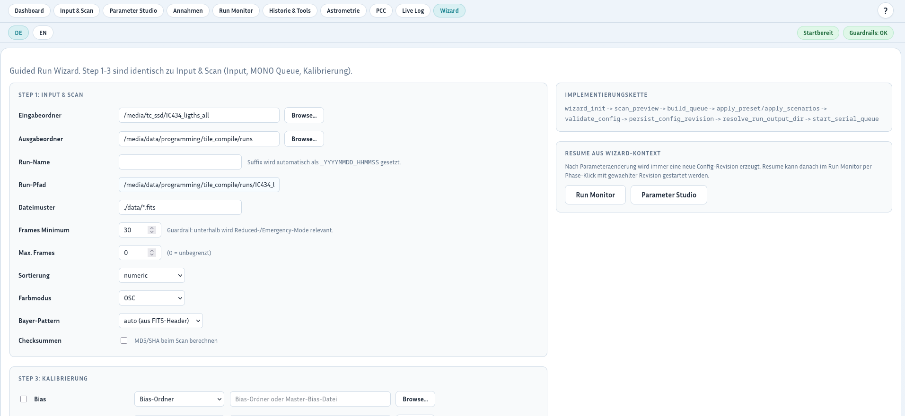
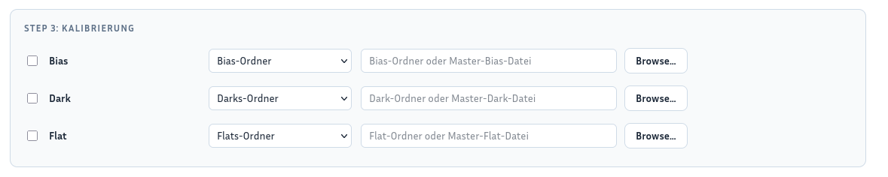
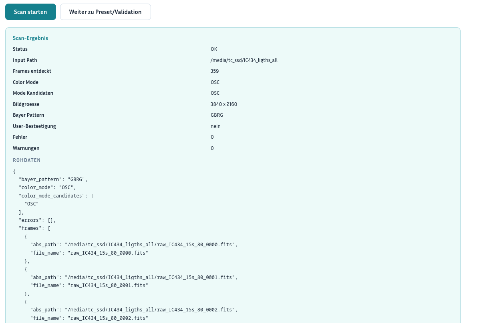
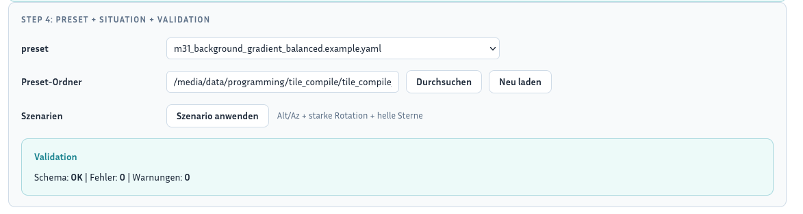

# Guided Wizard Step-by-Step

This guide describes the actual guided flow in `web_frontend/wizard.html`.
It does not use the normal menu pages as the primary workflow. Instead, it works directly through the steps inside the wizard page.

## Purpose of the wizard

The wizard guides the user through these steps on a single page:

- `Step 1: Input & Scan`
- `Step 2: Optional MONO Filter Queue`
- `Step 3: Calibration`
- `Step 4: Preset + Situation + Validation`
- then `Start Run`

---

## Step 1: Set Input & Scan inside the wizard

### Procedure

1. Open `wizard.html`.
2. Fill in the first block:
   - `Input directories`
   - `Runs Dir`
   - `Run Name`
   - `Pattern`
   - `Frames Minimum`
   - `Max. Frames`
   - `Sorting`
   - `Color mode` - is normally detected automatically from the scanned frames and only needs to be set when detection does not work
   - optional `Bayer pattern`
   - optional `Checksums`
3. Check the `Run path` preview.

### Result

- The base run data is set directly inside the wizard.

---

## Step 2: Optional MONO filter queue

This step only matters when `MONO` is used.

### Procedure

1. Check whether `Color mode` is set to `MONO`.
2. Enter one queue row per filter.
3. Set as needed:
   - `Filter`
   - `Input Dir`
   - optional `Pattern`
   - optional `Run Label`
4. Enable only the filters that are required.

### Result

- The serial MONO workflow is prepared directly inside the wizard.

---

## Step 3: Set calibration in the wizard

### Procedure

1. Enable the required calibration types:
   - `Bias`
   - `Dark`
   - `Flat`
2. Choose for each calibration type:
   - directory
   - master file
3. Enter the paths.
4. Check that mode and path match.

### Result

- Calibration data is set directly inside the wizard.

---

## Step 4: Start scan and review the result

### Procedure

1. Click `Scan starten`.
2. Wait for the `Scan-Ergebnis` block.
3. Check especially:
   - `Status`
   - `Frames entdeckt`
   - `Color Mode`
   - `Bildgroesse`
   - `Bayer Pattern`
   - `Fehler`
   - `Warnungen`
4. Correct the inputs if the result is not plausible.

### Result

- Input data is verified before the wizard proceeds.

---

## Step 5: Continue to preset, situation, and validation

### Procedure

1. Click `Weiter zu Preset/Validation`.
2. Select a `Preset`.
3. Use `Szenario anwenden` if needed.
4. Check the `Validation` block.
5. Continue only if no real errors remain.

### Result

- The wizard draft is configured and validated.

---

## Step 6: Start the run directly from the wizard

### Procedure

1. Check `Run path`, preset, and validation again.
2. Click `Run starten`.
3. After a successful start, the GUI switches to `Run Monitor`.

### Important

- The start button remains blocked until validation is successful.
- You can leave the wizard context via `Zum Parameter Studio` if you need deeper manual adjustments.

### Result

- The run is started directly from the wizard.

---

## Step 7: Resume from the wizard context

### Procedure

1. Open `Run Monitor` later.
2. Use a matching config revision if needed.
3. Start a resume run from the desired phase.

### Background

- Parameter changes create a new config revision.
- Resume itself does not happen in the wizard, but afterward in `Run Monitor`.

### Result

- The wizard is the entry flow, while resume remains part of the operational flow.

---

## Short checklist for the wizard

- Are input directories, runs dir, and run name set?
- Is the MONO queue only maintained when `MONO` is active?
- Are the calibration paths correct?
- Is the scan result plausible?
- Was a suitable preset selected?
- Is validation successful?
- Is the start button enabled?

---
