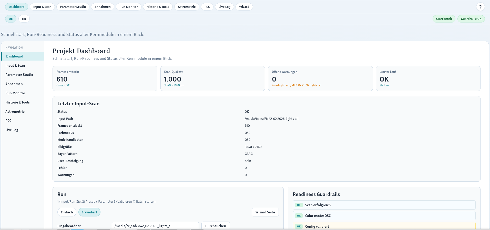
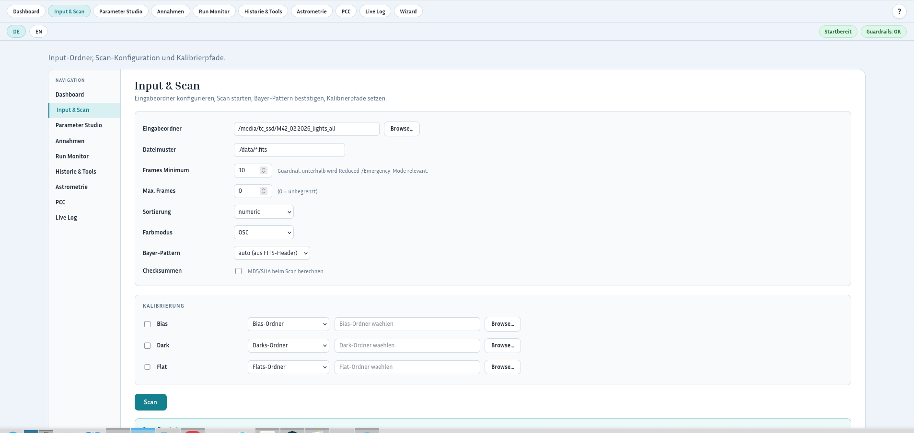
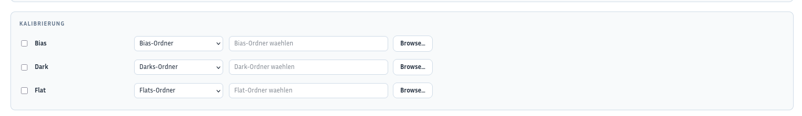
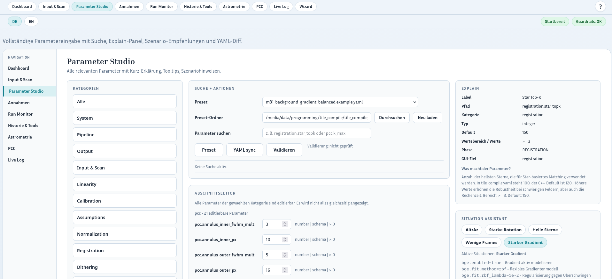
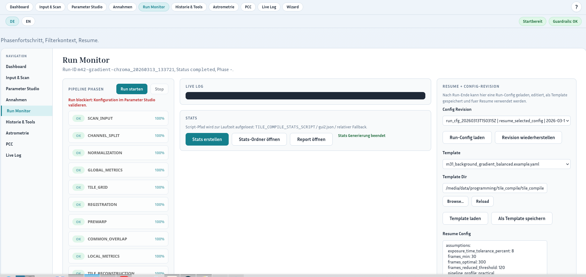
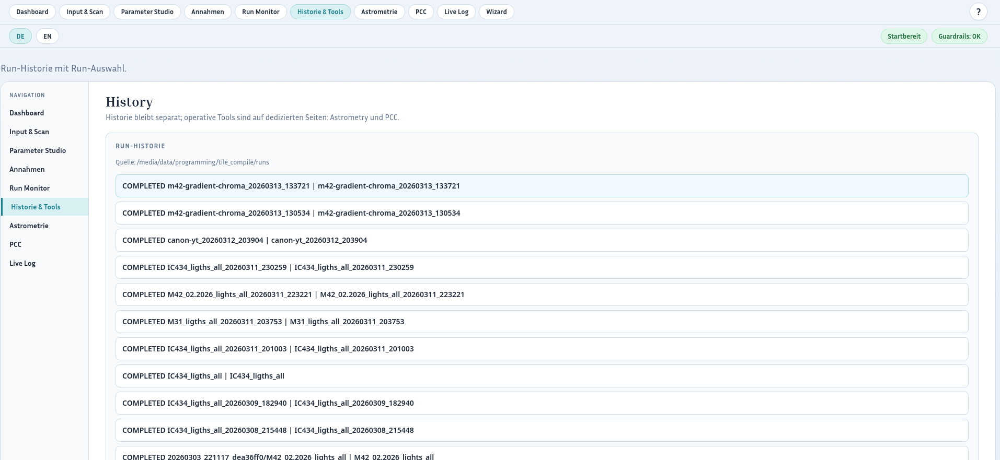

# Experteneingabe Schritt-fuer-Schritt

Diese Anleitung beschreibt den normalen Ablauf ueber die Menuepunkte der GUI.
Sie ist fuer Nutzer gedacht, die die Eingabe bewusst in den einzelnen Bereichen bearbeiten wollen und nicht den gefuehrten Wizard verwenden.

## Ziel der Experteneingabe

Die Experteneingabe fuehrt ueber die normalen Menuepunkte:

- `Dashboard`
- `Input & Scan`
- `Parameter Studio`
- `Run Monitor`
- optional `History + Tools`
- optional `Astrometrie`
- optional `PCC`

Dabei bearbeitest du jeden Abschnitt direkt in der dafuer vorgesehenen Seite.

---

## Schritt 1: Dashboard als Einstieg

### Vorgehen

1. Oeffne die GUI und starte auf dem `Dashboard`.
2. Pruefe, ob Projektkontext und Grundnavigation stimmen.
3. Verwende die Menueleiste, um in die Fachbereiche zu wechseln.

### Ergebnis

- Du startest nicht in einem gefuehrten Ablauf.
- Die Navigation erfolgt bewusst ueber die Menuepunkte.

---

## Schritt 2: Input & Scan aufrufen

### Vorgehen

1. Klicke im Menue auf `Input & Scan`.
2. Trage dort die Basisdaten ein:
   - `Eingabeordner`
   - `Runs Dir`
   - `Run Name`
   - `Dateimuster`
   - `Frames Minimum`
   - `Max. Frames`
   - `Sortierung`
   - `Farbmodus` - wird normalerweise automatisch aus den gescannten Frames erkannt und muss nur gesetzt werden, wenn die Erkennung nicht greift
   - `Bayer-Pattern`
3. Pruefe die Plausibilitaet der Eingaben vor dem Scan.

### Ergebnis

- Die Rohdatenquelle und die grundlegenden Scan-Parameter sind gesetzt.

---

## Schritt 3: Optionale MONO Queue pflegen

Step 3 - MONO Queue

Dieser Schritt ist nur relevant, wenn du mit `MONO` arbeitest.

### Vorgehen

1. Bleibe im Bereich `Input & Scan`.
2. Pflege dort die MONO-Queue fuer mehrere Filter.
3. Setze pro Zeile:
   - Filter
   - Input-Ordner
   - optional Pattern
   - optional Label
4. Aktiviere nur die Filter, die wirklich verarbeitet werden sollen.

### Ergebnis

- Der serielle Multi-Filter-Ablauf ist vorbereitet.

---

## Schritt 4: Kalibrierung im Eingabebereich setzen

### Vorgehen

1. Bleibe im Bereich `Input & Scan`.
2. Aktiviere die benoetigten Kalibrierarten:
   - `Bias`
   - `Dark`
   - `Flat`
3. Waehle je Typ:
   - Ordner
   - Master-Datei
4. Trage die passenden Pfade ein.
5. Fuehre danach den Scan aus und pruefe das Ergebnis.

### Ergebnis

- Eingaben, Queue und Kalibrierung sind im normalen Eingabefluss vorbereitet.

---

## Schritt 5: Parameter Studio oeffnen

### Vorgehen

1. Klicke im Menue auf `Parameter Studio`.
2. Passe dort die eigentlichen Verarbeitungsparameter an.
3. Arbeite bei Bedarf mit:
   - Presets
   - Suchfunktion
   - Szenarien
   - Validierung
4. Speichere die Konfiguration nach den Aenderungen.

### Ergebnis

- Die fachlichen Parameter werden getrennt von der Dateneingabe gepflegt.

---

## Schritt 6: Run Monitor fuer Start und Ueberwachung

### Vorgehen

1. Klicke im Menue auf `Run Monitor`.
2. Starte dort den Run mit der aktuell vorbereiteten Konfiguration.
3. Beobachte:
   - Phasen
   - Log-Ausgaben
   - Fortschritt
   - Artefakte
4. Erzeuge bei Bedarf einen Report aus dem laufenden oder abgeschlossenen Run.
5. Nutze bei Bedarf spaeter Resume oder Analysefunktionen.

### Ergebnis

- Der Lauf wird im operativen Monitor beobachtet statt innerhalb eines Wizards.
- Report-Erstellung ist Teil des normalen Betriebsflusses.

---

## Schritt 7: History + Tools fuer Nachbearbeitung

### Vorgehen

1. Klicke im Menue auf `History + Tools`.
2. Vergleiche dort Runs oder springe in Zusatzwerkzeuge.
3. Nutze den Bereich fuer Nachkontrolle, Report-Nutzung und spaetere Auswertung.

### Ergebnis

- Die Nachbearbeitung ist Teil des normalen Menue-Ablaufs.

---

## Schritt 8: Astrometrie als eigenen Menuepunkt nutzen

### Vorgehen

1. Klicke im Menue auf `Astrometrie`.
2. Oeffne dort den Astrometrie-Screen fuer Plate Solving und zugehoerige Einstellungen.
3. Stelle sicher, dass die benoetigten ASTAP-Daten heruntergeladen bzw. verfuegbar sind.
4. Pruefe Ergebnis und Log nach dem Astrometrie-Lauf.

### Ergebnis

- Astrometrie wird als eigener Menuepunkt im Expertenablauf bearbeitet.

---

## Schritt 9: PCC als eigenen Menuepunkt nutzen

### Vorgehen

1. Klicke im Menue auf `PCC`.
2. Oeffne dort den PCC-Screen fuer die photometrische Farbkalibrierung.
3. Stelle sicher, dass die benoetigten Siril-Daten heruntergeladen bzw. verfuegbar sind, wenn du mit lokalen PCC-Daten arbeiten willst.
4. Alternativ kann PCC auch mit den Online-Katalogen `vizir_gaia` und `vizir_apass` arbeiten.
5. Pruefe Ergebnis und Log nach dem PCC-Lauf.

### Ergebnis

- PCC wird als eigener Menuepunkt im Expertenablauf bearbeitet.

---

## Externe Quellen (PCC und Astrometrie)

Fuer optionale Farbkalibrierung und astrometrisches Solving kann die Pipeline externe Daten/Werkzeuge verwenden:

- **Siril Gaia DR3 XP sampled catalog** (fuer PCC)
  - Kann wiederverwendet werden, wenn er bereits von Siril heruntergeladen wurde.
  - Typischer lokaler Pfad: `~/.local/share/siril/siril_cat1_healpix8_xpsamp/`
  - Upstream-Quelle (Katalog-Release): `https://zenodo.org/records/14738271`
- **ASTAP** (fuer Astrometrie / WCS Plate Solving)
  - Benoetigt ASTAP plus eine Stern-Datenbank, z. B. D50 fuer Deep-Sky-Anwendungen.
  - Offizielle Seite/Downloads: `https://www.hnsky.org/astap.htm`

Wenn diese Ressourcen nicht installiert sind, funktioniert die Kernrekonstruktion weiterhin, aber die Phasen `ASTROMETRY` und `PCC` koennen je nach Konfiguration uebersprungen werden oder fehlschlagen.

---

## Kurze Checkliste fuer die Experteneingabe

- Wurden die Eingaben in `Input & Scan` sauber gesetzt?
- Ist die MONO-Queue nur dann gepflegt, wenn `MONO` aktiv ist?
- Sind die Kalibrierpfade korrekt?
- Wurden die Verarbeitungsparameter im `Parameter Studio` validiert?
- Erfolgt der Start ueber den normalen Betriebsfluss?
- Wurde der Report bei Bedarf erzeugt oder geprueft?
- Sind fuer `Astrometrie` die benoetigten ASTAP-Daten vorhanden?
- Sind fuer `PCC` entweder die benoetigten Siril-Daten oder ein passender Online-Katalog wie `vizir_gaia` oder `vizir_apass` verfuegbar?

---
