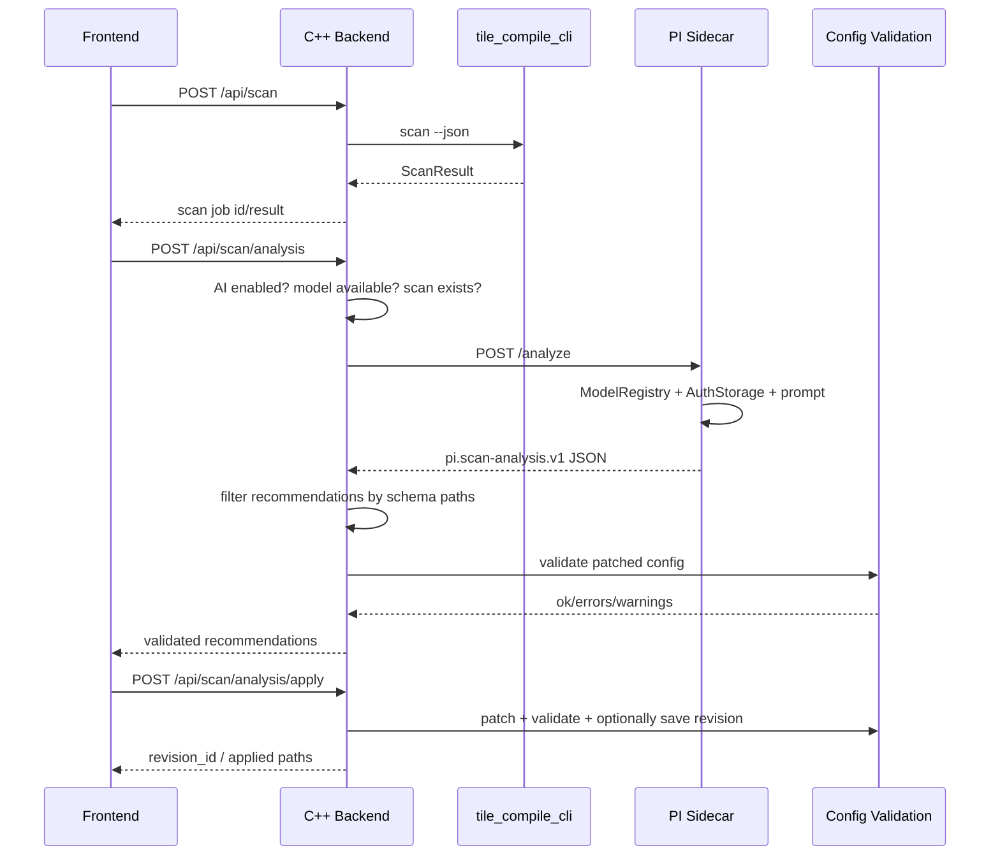

# PI Scan-AI Implementierungsplan

**Status:** Implementierung begonnen, Backend-Grundgeruest erledigt  
**Datum:** 2026-06-15  
**Ziel:** PI Scan-AI in `tile_compile` integrieren, damit Scan-Ergebnisse in validierte Parameter-Studio-Empfehlungen uebersetzt werden koennen.  
**Grundsatz:** AI ist standardmaessig aus. Ohne explizite Aktivierung und gueltige Credentials werden keine externen AI-Requests ausgefuehrt.

---

## 0. Umsetzungsstand

Stand: 2026-06-15.

Erledigt:

- [x] Optionales `agent_service` Node/TypeScript-Projekt angelegt.
- [x] `@earendil-works/pi-coding-agent` als Dependency vorgesehen.
- [x] `.env.example` und `.env`-Laden aus Projektwurzel und `agent_service/.env` vorgesehen.
- [x] Sidecar-Routen `/health`, `/models`, `/auth`, `DELETE /auth/:provider`, `/test`, `/analyze` angelegt.
- [x] C++ AI-Service und Sidecar-HTTP-Client angelegt.
- [x] C++ Backend-Routen `/api/ai/*` und `/api/scan/analysis*` registriert.
- [x] AI ist default aus.
- [x] Backend funktioniert ohne laufenden Sidecar weiter.
- [x] `/api/ai/models` meldet fehlenden Sidecar strukturiert als `AI_AGENT_UNAVAILABLE`.
- [x] API-Keys werden nicht in Backend-Config, UI-State oder Responses gespeichert.
- [x] Frontend-API-Konstanten fuer AI/Scan-Analysis ergaenzt.
- [x] Release-/Packaging-Skripte bundeln den optionalen `agent_service`.
- [x] Backend-Test fuer Default-off und Sidecar-unavailable angelegt.
- [x] `cmake --build web_backend_cpp/build` erfolgreich.
- [x] `ctest --output-on-failure -R web_backend_cpp_ai_routes` erfolgreich.

In Arbeit/offen:

- [x] Schema-/Config-Validierung der AI-Empfehlungen im Backend umsetzen.
- [x] `/api/scan/analysis/apply` im Backend implementieren.
- [x] Frontend-Basis fuer Settings, Analyseanzeige und Review-/Apply-Flow integrieren.
- [x] Sidecar TypeScript Build nach Dependency-Installation verifiziert.
- [ ] Secret-Redaction-Audit auf Sidecar-Logs erweitern.

## 1. Architekturentscheidungen

1. Der PI Agent wird als lokaler Node/TypeScript-Sidecar implementiert.
2. Das C++ Backend bleibt fuer Scan, Jobs, Config-Patches und Validierung verantwortlich.
3. Der Sidecar kennt Provider, Modelle, AuthStorage und `.env`.
4. Das Backend validiert alle AI-Empfehlungen gegen Schema und bestehende Config-Validierung.
5. Die UI zeigt AI als optionales Feature. Manuelle Szenario-Deltas bleiben immer verfuegbar.
6. Intern wird `updates: [{path, value}]` als kanonisches Patch-Format verwendet.
7. `force` ist nur ein expliziter One-shot fuer eine bestaetigte UI-Aktion und speichert keine dauerhafte Aktivierung.

---

## 2. Zielarchitektur

```text
web_frontend
  -> C++ Web Backend
     -> tile_compile_cli scan / config validate / config patch
     -> Node PI Sidecar
        -> @earendil-works/pi-coding-agent
           -> PI AuthStorage
           -> PI ModelRegistry
           -> externe AI Provider
```

### 2.1 Komponenten

| Komponente | Aufgabe |
|---|---|
| `web_frontend/src/app.js` | Scan-Flow, AI-Settings, Analyseanzeige, Apply-Flow |
| `web_frontend/src/constants.js` | API-Endpunkte fuer AI und Scan-Analysis |
| `web_backend_cpp/src/routes/ai_routes.cpp` | C++ REST-Routen fuer AI-Config, Modelle, Auth, Analyse, Apply |
| `web_backend_cpp/src/services/ai_service.cpp` | Backend-seitiger Client zum Sidecar und Filter-/Validierungslogik |
| `agent_service/src/server.ts` | Lokaler HTTP-Server fuer PI-Integration |
| `agent_service/src/services/frameAnalysisService.ts` | PI Session, Prompt, JSON-Parsing |
| `agent_service/src/services/authService.ts` | AuthStorage, `.env`, Provider-Key-Status |
| `agent_service/src/services/modelService.ts` | PI ModelRegistry und Modellliste |

### 2.2 Datenfluss



---

## 3. Konfiguration und Secrets

### 3.1 Default-Konfiguration

AI ist per Default aus:

```yaml
ai:
  scan_analysis:
    enabled: false
    mode: manual
    provider: ""
    model: ""
    temperature: 0.2
    max_tokens: 8000
    timeout_ms: 120000
    send_paths: false
    persist_recommendations: false
    sidecar_url: "http://127.0.0.1:3001"
```

Diese Werte duerfen in App-State oder lokaler Backend-Settings-Datei stehen. Wenn sie in `tile_compile.yaml` aufgenommen werden, dann nur nicht-sensitive Werte.

### 3.2 Credential-Quellen

Der Sidecar muss API-Keys aus diesen Quellen erkennen:

1. PI `AuthStorage`
2. Prozess-Environment
3. `agent_service/.env`
4. Projektwurzel `.env`

Vorgesehene Variablen:

```dotenv
AI_SCAN_ENABLED=false
AI_SCAN_MODEL=anthropic/claude-sonnet-4-6
AI_SCAN_MAX_TOKENS=8000
AI_SCAN_TEMPERATURE=0.2
AI_SCAN_TIMEOUT_MS=120000

ANTHROPIC_API_KEY=...
OPENAI_API_KEY=...
GOOGLE_API_KEY=...
GEMINI_API_KEY=...
MISTRAL_API_KEY=...
GROQ_API_KEY=...
OPENROUTER_API_KEY=...
```

Provider-spezifische Namen werden an PI angepasst. Wenn PI fuer einen Provider andere Variablen erwartet, mappt der Sidecar die bekannte `.env`-Variable auf PI `AuthStorage` oder auf die PI-kompatible Environment-Form.

### 3.3 Secret-Regeln

- Keine API-Keys in `tile_compile.yaml`.
- Keine API-Keys in Config-Revisions.
- Keine API-Keys in JobStore.
- Keine API-Keys in UI-State.
- Keine API-Keys in Logs.
- API-Responses duerfen nur Status und Quelle enthalten, zum Beispiel `source: "env"` oder `source: "auth_storage"`.

---

## 4. API-Contract

### 4.1 C++ Backend-Routen

| Route | Methode | Zweck |
|---|---|---|
| `/api/ai/config` | GET | Aktuelle AI-Settings ohne Secrets |
| `/api/ai/config` | PATCH | Nicht-sensitive AI-Settings aktualisieren |
| `/api/ai/models` | GET | Provider/Modelle aus PI Registry plus Auth-Status |
| `/api/ai/auth` | POST | API-Key fuer Provider im PI AuthStorage speichern |
| `/api/ai/test` | POST | Provider/Modell-Verbindung testen |
| `/api/ai/auth/<provider>` | DELETE | Gespeicherten Key entfernen, `.env` bleibt unangetastet |
| `/api/scan/analysis` | POST | Scan-AI-Analyse starten |
| `/api/scan/analysis/latest` | GET | Letzte Analyse abrufen |
| `/api/scan/analysis/apply` | POST | Validierte Empfehlungen anwenden |

### 4.2 Sidecar-Routen

| Route | Methode | Zweck |
|---|---|---|
| `/health` | GET | Sidecar erreichbar? |
| `/models` | GET | PI Registry Provider/Modelle/Auth-Status |
| `/auth` | POST | Provider-Key speichern |
| `/auth/:provider` | DELETE | Provider-Key entfernen |
| `/test` | POST | Minimalen Modelltest ausfuehren |
| `/analyze` | POST | Scan-Metriken analysieren |

### 4.3 Scan Analysis Request

```json
{
  "scan_job_id": "optional",
  "scan_result": {},
  "base_config": {},
  "persist": false,
  "force": false,
  "model": "optional provider/model-id",
  "selected_profile": "optional"
}
```

Regeln:

- Wenn `scan_result` fehlt, nimmt das Backend `/api/scan/latest`.
- Wenn `base_config` fehlt, nimmt das Backend `/api/config/defaults` oder den aktiven Draft.
- Wenn AI deaktiviert ist und `force=false`, antwortet das Backend mit `AI_DISABLED`.
- `force=true` ist nur fuer eine explizite UI-Aktion zulaessig und darf keine dauerhafte Aktivierung speichern.

### 4.4 Agent Response

Der Sidecar muss ausschliesslich JSON liefern:

```json
{
  "schema_version": "pi.scan-analysis.v1",
  "summary": "Kurze technische Zusammenfassung",
  "confidence": 0.86,
  "detected_scenarios": [
    {
      "id": "rotation",
      "label": "Starke Rotation",
      "confidence": 0.82,
      "evidence": ["rotation proxy high"]
    }
  ],
  "recommendations": [
    {
      "path": "registration.engine",
      "value": "triangle_star_matching",
      "reason": "Rotation spricht fuer sternbasierte Registrierung.",
      "confidence": 0.9,
      "risk": "low"
    }
  ],
  "warnings": [],
  "review_required": true
}
```

Kanonisches Backend-Apply-Format:

```json
{
  "updates": [
    {"path": "registration.engine", "value": "triangle_star_matching"},
    {"path": "registration.transform_model", "value": "affine"}
  ]
}
```

Das Backend kann daraus fuer die UI einen verschachtelten Patch ableiten. Intern sollte aber `updates[]` verwendet werden, weil `/api/config/patch` bereits mit Dotted Paths arbeitet.

---

## 5. Implementierungsphasen

### Phase 0: Abhaengigkeiten und Entscheidungen `[erledigt]`

**Ziel:** Projektstruktur und Laufzeitmodell festlegen.

Aufgaben:

- Node-Version fuer `agent_service` dokumentieren.
- `agent_service/package.json` anlegen.
- Dependency `@earendil-works/pi-coding-agent` aufnehmen.
- Dependency fuer HTTP-Server waehlen. Empfehlung: `express` oder Node `http`.
- Dependency fuer `.env` laden. Empfehlung: `dotenv`.
- Sidecar-Port konfigurieren, default `127.0.0.1:3001`.
- C++ HTTP-Client festlegen. Empfehlung: libcurl, falls im Build akzeptiert.

Akzeptanz:

- `agent_service` kann lokal starten.
- `/health` liefert `ok`.
- Ohne AI-Key startet der Sidecar trotzdem.

### Phase 1: Sidecar-Grundgeruest `[erledigt]`

Neue Dateien:

```text
agent_service/
  package.json
  tsconfig.json
  .env.example
  src/
    server.ts
    types.ts
    config.ts
    services/
      authService.ts
      modelService.ts
      frameAnalysisService.ts
```

Funktionen:

- `.env` aus `agent_service/.env` und Projektwurzel laden.
- PI `AuthStorage` initialisieren.
- PI `ModelRegistry` initialisieren.
- `/models` implementieren.
- `/test` implementieren.
- `/auth` und `DELETE /auth/:provider` implementieren.
- Secret-Werte in Logs konsequent redigieren.

Akzeptanz:

- `/models` liefert Provider/Modelle, auch wenn keine Keys vorhanden sind.
- `.env`-Keys werden als verfuegbar erkannt.
- UI/Backend sieht nur `available`, `missing_auth`, `auth_source`, nicht den Key.

### Phase 2: Sidecar Analyse-Service `[erledigt]`

`frameAnalysisService.ts` implementiert:

- Modell aus `provider/model-id` aufloesen.
- Verfuegbarkeit mit `ModelRegistry.getAvailable()` pruefen.
- Session mit `createAgentSession(...)` erstellen.
- Prompt bauen.
- Textdelta sammeln.
- JSON extrahieren und parsen.
- Antwort gegen Minimalcontract pruefen.

Prompt-Regeln:

- Keine Rohframes anfordern.
- Keine absoluten Pfade verwenden, wenn `send_paths=false`.
- Keine Werte erfinden.
- Nur erlaubte Schema-Pfade verwenden.
- Unsichere Empfehlungen mit niedriger Confidence oder `review_required=true`.

Akzeptanz:

- `/analyze` liefert bei deaktivierter/fehlender Auth einen klaren Fehler.
- Gueltige Analyse liefert `schema_version: pi.scan-analysis.v1`.
- Ungueltige Modellnamen werden klar gemeldet.

### Phase 3: C++ AI-Service `[erledigt]`

Neue Dateien:

```text
web_backend_cpp/include/services/ai_service.hpp
web_backend_cpp/src/services/ai_service.cpp
web_backend_cpp/include/routes/ai_routes.hpp
web_backend_cpp/src/routes/ai_routes.cpp
```

Wichtig: `AppState` ist aktuell ein `struct` in `web_backend_cpp/include/app_state.hpp`. Um Include-Zyklen zu vermeiden, sollte `ai_service.hpp` nicht zwingend in `app_state.hpp` eingebettet werden. Einfacher ist:

- AI-Service als lokale Helper-Klasse/Funktion in `ai_routes.cpp`, oder
- `std::shared_ptr<void>` vermeiden und stattdessen `AiBackendClient` in Route-Datei erzeugen, oder
- Forward Declaration sauber einsetzen.

Empfehlung fuer ersten Schritt: kein permanentes `state->ai_service`. Die Routen erzeugen einen leichten `AiBackendClient` mit `state->runtime` und aktueller Config.

Aufgaben:

- HTTP-Client zum Sidecar implementieren.
- Timeout beachten.
- `/api/ai/config` aus App-State oder lokaler Settings-Datei lesen/schreiben.
- `/api/ai/models`, `/api/ai/auth`, `/api/ai/test` zum Sidecar proxyen.
- `/api/scan/analysis` implementieren.
- `/api/scan/analysis/latest` aus JobStore lesen.
- `/api/scan/analysis/apply` ueber vorhandene Config-Patch-/Validate-Logik ausfuehren.

Akzeptanz:

- Backend kompiliert ohne laufenden Sidecar.
- `/api/ai/models` meldet Sidecar-unreachable strukturiert.
- `/api/scan/analysis` blockiert Scan nicht.
- Fehler im Sidecar fuehren zu `AI_AGENT_UNAVAILABLE`, nicht zu Backend-Crash.

### Phase 4: Schema- und Config-Validierung `[erledigt im Backend]`

Diese Phase ist kritisch. AI-Ausgabe ist untrusted.

Validierungsschritte:

1. Response ist JSON-Object.
2. `schema_version == "pi.scan-analysis.v1"`.
3. `recommendations[]` ist Array.
4. Jeder `path` ist ein bekannter Schema-Pfad aus `/api/config/schema`.
5. Jeder `value` passt grob zum Schema-Typ.
6. Updates werden auf Base-Config angewendet.
7. Ergebnis wird mit bestehender `/api/config/validate`-Logik validiert.
8. Nur valide Updates werden als `applicable=true` markiert.
9. Unsichere Updates behalten `review_required=true`.

Logikfehler vermeiden:

- Ein verschachteltes `config_patch` darf nicht per `contains("registration.engine")` gelesen werden.
- Dotted Path Updates immer ueber vorhandene `set_dotted(...)`-Semantik anwenden.
- `selected_paths` muss gegen validierte Recommendations laufen, nicht gegen rohe AI-Antwort.
- `persist=true` darf erst nach erfolgreicher Validierung speichern.

Akzeptanz:

- Unbekannte Pfade werden verworfen und gemeldet.
- Falsche Typen werden verworfen und gemeldet.
- Validierungsfehler werden der UI angezeigt.
- Keine Teilpersistenz bei invalidem Gesamtpatch, ausser der User waehlte explizit nur valide Einzelupdates.

### Phase 5: Frontend Integration `[Basis erledigt]`

Anzupassende Dateien:

```text
web_frontend/src/constants.js
web_frontend/src/api.js
web_frontend/src/app.js
web_frontend/input-scan.html
web_frontend/parameter-studio.html
web_frontend/i18n/de.json
web_frontend/i18n/en.json
web_frontend/style.css
web_frontend/layout-panels.css
```

UI-Orte:

- Input Scan: Button `KI-Analyse erstellen` nach erfolgreichem Scan.
- Parameter Studio: AI-Settings und Analyse-Deltas.
- Dashboard optional: AI-Status und letzter Analysehinweis.

UI-Zustaende:

- `AI deaktiviert`
- `AI aktiviert, Provider fehlt`
- `AI aktiviert, API-Key fehlt`
- `Sidecar nicht erreichbar`
- `Analyse laeuft`
- `Analyse erfolgreich`
- `Analyse mit Warnungen`
- `Analyse fehlgeschlagen`

Aktionen:

- AI aktivieren/deaktivieren.
- Provider/Modell aus PI Registry waehlen.
- API-Key eingeben.
- Verbindung testen.
- Analyse starten.
- Empfehlungen einzeln auswaehlen.
- Alle validen Empfehlungen anwenden.
- Zum Parameter Studio mit aktiver Kategorie springen.

Sicherheitsregeln UI:

- API-Key-Feld darf nie mit bestehendem Key vorbelegt werden.
- `.env`-Key darf nur als `aus .env erkannt` angezeigt werden.
- Externe AI-Request-Aktion muss erkennbar sein.

### Phase 6: JobStore, Revisions und Audit `[teilweise erledigt]`

Analyse-Jobs:

```json
{
  "type": "scan_ai_analysis",
  "data": {
    "analysis_id": "job-id",
    "scan_job_id": "scan-id",
    "provider": "anthropic",
    "model": "anthropic/claude-sonnet-4-6",
    "confidence": 0.86,
    "recommendations": [],
    "validated_updates": [],
    "rejected_updates": [],
    "warnings": []
  }
}
```

Keine Secrets in Job-Daten.

Revision-Metadaten:

- `source: pi_scan_ai`
- `analysis_id`
- `scan_job_id`
- `provider`
- `model`
- `confidence`
- `applied_paths`
- `rejected_paths`

Akzeptanz:

- `/api/scan/analysis/latest` findet die letzte Analyse.
- Apply erzeugt eine Config-Revision mit Quelle `pi_scan_ai`.
- Revision enthaelt keine Secrets.

### Phase 7: Tests `[teilweise erledigt]`

Backend-Tests:

- [x] AI default disabled.
- [x] `/api/scan/analysis` gibt `AI_DISABLED`, wenn disabled.
- [x] `force=true` wird nur pro Request akzeptiert und speichert kein enabled.
- [x] Sidecar unavailable -> strukturierter Fehler.
- [x] Unknown path -> rejected update.
- [x] Wrong type -> rejected update.
- [x] Valid update -> validated.
- [x] Apply ohne Analyse-ID -> Fehlerantwort.
- [x] Apply mit selected_paths -> nur diese Pfade.
- [x] Keine Secrets in Responses fuer Backend-Config/Auth-Proxy.

Sidecar-Tests:

- `.env` wird geladen.
- Environment priorisiert gegenueber Projekt-`.env`.
- AuthStorage priorisiert gegenueber Environment.
- `/models` redigiert Secrets.
- ungueltiges Modell -> Fehler.
- leere AI-Antwort -> Fehler.
- JSON mit Markdown-Wrapper wird extrahiert.

Frontend-Tests oder manuelle Checkliste:

- AI Settings laden.
- Providerliste anzeigen.
- `.env`-Status anzeigen ohne Key.
- Analysebutton nur sinnvoll nach Scan.
- Analyseergebnis zeigt Empfehlungen und Warnungen.
- Apply aktualisiert Config-Draft/Revision.

### Phase 8: Build und Betrieb `[teilweise erledigt]`

Build:

- [x] `cmake --build web_backend_cpp/build` fuer C++ Backend.
- [x] `npm install` im `agent_service`.
- [x] `npm run build` im `agent_service`.
- Optional `npm run dev` fuer lokalen Sidecar.

Runtime:

- Sidecar startet separat oder wird durch Startscript gestartet.
- Backend bleibt funktionsfaehig, wenn Sidecar fehlt.
- `start_backend.sh` kann optional Sidecar-Start aufnehmen, aber darf Backend nicht hart davon abhaengig machen.

Konfiguration:

- `AI_SCAN_ENABLED=false` default.
- Sidecar URL via Env oder App-State.
- Timeout default 120s.

---

## 6. Detaillierte Dateiliste

### 6.1 Neu

| Datei | Zweck |
|---|---|
| `agent_service/package.json` | Node-Projekt mit PI Dependency |
| `agent_service/tsconfig.json` | TypeScript Build |
| `agent_service/.env.example` | Beispiel ohne echte Keys |
| `agent_service/src/server.ts` | HTTP API |
| `agent_service/src/types.ts` | Request/Response Types |
| `agent_service/src/config.ts` | Env-/Runtime-Konfig |
| `agent_service/src/services/authService.ts` | AuthStorage + `.env` |
| `agent_service/src/services/modelService.ts` | ModelRegistry |
| `agent_service/src/services/frameAnalysisService.ts` | PI Analyse |
| `web_backend_cpp/include/routes/ai_routes.hpp` | Route Declaration |
| `web_backend_cpp/src/routes/ai_routes.cpp` | REST Routen |
| `web_backend_cpp/include/services/ai_service.hpp` | Backend AI Client/Helpers |
| `web_backend_cpp/src/services/ai_service.cpp` | Sidecar HTTP Client + Validation |
| `web_backend_cpp/tests/test_ai_routes.cpp` | API Tests |
| `web_backend_cpp/tests/test_ai_service.cpp` | Validation Tests |

### 6.2 Zu aendern

| Datei | Aenderung |
|---|---|
| `web_backend_cpp/src/main.cpp` | `register_ai_routes(app, state)` registrieren |
| `web_backend_cpp/CMakeLists.txt` | neue C++ Dateien und Tests einbinden |
| `web_backend_cpp/include/backend_runtime.hpp` | AI/Sidecar Settings, falls Runtime-basiert |
| `web_backend_cpp/src/backend_runtime.cpp` | Defaults und Env lesen |
| `web_frontend/src/constants.js` | AI Endpunkte |
| `web_frontend/src/api.js` | optional API Helper oder direkte `api.get/post` Nutzung |
| `web_frontend/src/app.js` | UI-Flow |
| `web_frontend/input-scan.html` | Analysepanel |
| `web_frontend/parameter-studio.html` | AI Settings/Review |
| `web_frontend/i18n/de.json` | Texte |
| `web_frontend/i18n/en.json` | Texte |
| `web_frontend/style.css` / `layout-panels.css` | UI Styles |
| `start_backend.sh` | optional Sidecar-Start |
| `.gitignore` | `.env`, `agent_service/node_modules`, Build-Ausgaben |

---

## 7. Detaillierter Ablauf fuer `/api/scan/analysis`

1. Request parsen.
2. ScanResult bestimmen:
   - `body.scan_result`, oder
   - `scan_job_id`, oder
   - `latest_scan_job(...)`.
3. AI Config laden.
4. Wenn disabled und kein explizit bestaetigter One-shot: `AI_DISABLED`.
5. Sidecar Health pruefen.
6. Modell bestimmen:
   - Request `model`, oder
   - Config `model`, oder
   - Fehler `AI_MODEL_NOT_CONFIGURED`.
7. Modelle/Auth vom Sidecar pruefen.
8. Base Config bestimmen.
9. Schema-Pfade flatten.
10. Request minimieren:
    - keine Rohframes
    - keine absoluten Pfade, wenn `send_paths=false`
    - Frame-Liste limitieren
    - Warnungen/Fehler beibehalten
11. Sidecar `/analyze` aufrufen.
12. Response validieren.
13. Recommendations normalisieren zu `updates[]`.
14. Updates gegen Schema filtern.
15. Patch auf Base Config anwenden.
16. Config validieren.
17. Analyse-Job speichern.
18. JSON Response an UI.

---

## 8. Detaillierter Ablauf fuer `/api/scan/analysis/apply`

1. Request parsen.
2. `analysis_id` laden.
3. Analyse-Job muss Typ `scan_ai_analysis` haben.
4. `selected_paths` aus Request lesen.
5. Nur zuvor validierte Updates verwenden.
6. Falls `selected_paths` leer:
   - entweder alle validen Updates anwenden, oder
   - wenn UI `apply_all=false`, Fehler melden.
7. Aktuelle Config laden.
8. Updates anwenden.
9. Config validieren.
10. Bei `persist=true` speichern.
11. Revision mit Quelle `pi_scan_ai` anlegen.
12. Response mit `revision_id`, `applied_paths`, `warnings`.

---

## 9. Risiken und Gegenmassnahmen

| Risiko | Gegenmassnahme |
|---|---|
| Externe AI-Requests unerwartet | Default-off, sichtbare UI-Aktion, `mode=manual` |
| Secrets landen in Logs | Redaction helper, Tests, keine Secret-Responses |
| AI empfiehlt ungueltige Config | Schema-Filter + Config-Validate |
| Sidecar faellt aus | Backend bleibt nutzbar, strukturierter Fehler |
| Modellliste aendert sich | PI `ModelRegistry` dynamisch abfragen |
| Lange Analyse blockiert UI | Analyse als Job/async Status, Timeout |
| Absolute Pfade werden gesendet | `send_paths=false` default, Sanitizer |
| Kosten durch Auto-Analyse | `mode=after_scan` nur opt-in |

---

## 10. Akzeptanzkriterien

### Must-have

- [x] AI ist default aus.
- [x] Ohne Sidecar funktioniert Scan unveraendert.
- [x] Ohne API-Key gibt es keine externen Requests.
- [x] `.env` und Prozess-Environment werden als Credential-Quelle erkannt.
- [x] API-Keys werden nie in Config, Revisions, JobStore, Logs oder UI-State gespeichert.
- [x] Alle PI-Registry-Modelle werden angezeigt, soweit PI sie liefert.
- [x] `/api/scan/analysis` erzeugt validierte Recommendations.
- [x] Unbekannte/ungueltige Recommendations werden verworfen.
- [x] Apply erzeugt validierte Config und optional Revision.
- [x] Parameter Studio zeigt Confidence, Risiko, Begruendung und Warnungen.

### Should-have

- [x] One-shot Analyse auch bei disabled moeglich, aber nur nach UI-Bestaetigung.
- [x] Sidecar-/Modelstatus im UI sichtbar.
- [x] Analyse kann timeouted werden.
- [x] Deterministischer Fallback zeigt vorhandene Szenario-Deltas.

### Nice-to-have

- [ ] Analyseprofile fuer `cheap`, `balanced`, `best`.
- [ ] Kosten-/Token-Schaetzung vor Request.
- [ ] Analysevergleich zwischen Modellen.

---

## 11. Rollback

Rollback muss trivial bleiben:

1. Sidecar nicht starten.
2. AI Config `enabled=false`.
3. `register_ai_routes(...)` kann notfalls entfernt werden.
4. Backend und Frontend funktionieren weiter mit Scan, Config und Parameter Studio.

Da AI optional ist, darf kein bestehender Stacking- oder Scan-Pfad von AI abhaengig werden.

---

## 12. Implementierungsreihenfolge kompakt

1. Sidecar Skeleton + `/health`.
2. `.env` + AuthStorage + ModelRegistry.
3. `/models`, `/auth`, `/test`.
4. `FrameAnalysisService` + `/analyze`.
5. C++ AI Backend Client.
6. C++ AI Routes.
7. Schema-/Config-Validation. `[erledigt im Backend]`
8. JobStore/Revision Integration. `[erledigt im Backend]`
9. Frontend Settings. `[Basis erledigt]`
10. Frontend Scan-Analysepanel. `[Basis erledigt]`
11. Apply-Flow im Parameter Studio. `[Basis erledigt]`
12. Tests und Secret-Redaction-Audit.
