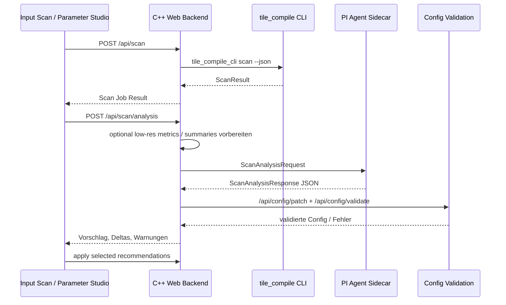
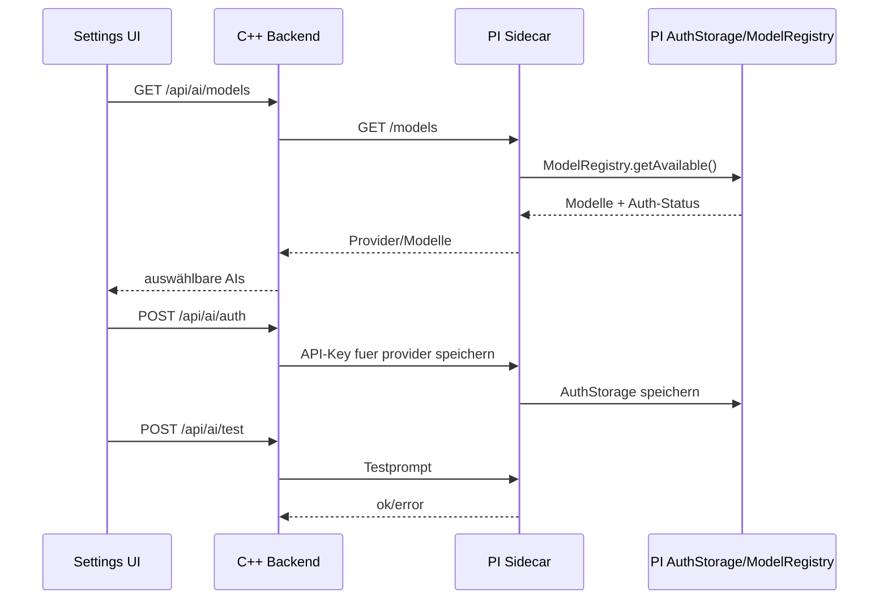

# PI Scan-AI fuer Parameter Studio

**Status:** Entwurf fuer Implementierung  
**Ziel:** Beim Input-Scan sollen Frames nicht nur technisch erkannt, sondern inhaltlich bewertet werden. Aus dieser Analyse soll eine passende, validierte Konfiguration fuer das Parameter Studio entstehen, damit der Stacking-Prozess mit einer moeglichst guten Startkonfiguration beginnt.

## 1. Zielbild

Der aktuelle Scan liefert bereits Basisdaten:

- Anzahl Frames
- Bildgroesse
- `color_mode`
- `bayer_pattern`
- Warnungen und Fehler
- Frame-Liste

Das neue PI-Analysetool erweitert diesen Schritt um eine qualitative Frame-Analyse und erzeugt daraus konkrete Konfigurationsvorschlaege. Die KI trifft dabei keine ungeprueften finalen Entscheidungen. Sie erstellt erklaerte Empfehlungen, die vom Backend gegen Schema und Guardrails validiert werden und im Parameter Studio als Vorschlag angewendet oder angepasst werden koennen.

## 2. Technischer Ansatz

Da `tile_compile` aktuell ein C++ Backend und ein statisches Frontend nutzt, das referenzierte Paket `@earendil-works/pi-coding-agent` aber TypeScript/Node ist, sollte die KI-Integration als kleiner lokaler Sidecar-Service umgesetzt werden.

Empfohlene Struktur:

```text
tile_compile/
  agent_service/
    package.json
    tsconfig.json
    src/
      services/
        frameAnalysisService.ts
      server.ts
      types.ts
  web_backend_cpp/
    src/routes/scan_analysis_routes.cpp
    include/routes/scan_analysis_routes.hpp
```

Der Sidecar nutzt denselben Integrationsstil wie:

```text
/media/data/programming/org-bigflutter-nextjs15/src/agent/services/claudeService.ts
```

Kernpunkte daraus:

- `AuthStorage.create()`
- `ModelRegistry.create(authStorage)`
- Modell im Format `provider/model-id`, aus PI-Registry oder expliziter Konfiguration
- `createAgentSession(...)`
- `session.subscribe(...)` sammelt `text_delta`
- `session.prompt(prompt)`
- Antwort strikt als JSON parsen
- keine direkte Anthropic-SDK-Abhaengigkeit
- alle von PI vorgesehenen Provider/Modelle werden ueber `ModelRegistry` ermittelt, nicht hart im tile_compile-Code verdrahtet

## 3. Datenfluss



## 4. Analyseumfang

Die KI sollte keine kompletten FITS-Dateien bekommen. Uebergeben werden nur strukturierte, reduzierte Metriken:

- Scan-Basisdaten: Framezahl, Bildgroesse, Farbmodus, Bayer-Pattern, Kandidaten und Warnungen
- Header-Metadaten: Belichtung, Gain/ISO, Temperatur, Filter, Instrument, Datum, falls vorhanden
- Frame-Statistik als Aggregat: Median, MAD/Rauschmass, Hintergrundlevel, Sättigungsanteil
- Qualitaetsindizien: Sternanzahl, FWHM-Schaetzung, Rundheit, Gradient, Hotpixel-/Cosmetic-Score
- Sequenzindizien: Drift, Rotation, Dither-Offsets, Ausreisseranteil
- Kalibrierhinweise: Bias/Dark/Flat vorhanden, Master-Datei vs. Ordner, dunkle Frames passend
- Ressourcen: Framezahl, Aufloesung, geschaetzter Speicherbedarf fuer AQMH Maps

Der erste Implementierungsschritt kann mit den vorhandenen Scan-Daten starten. Fuer bessere Empfehlungen sollte der Scanner danach um eine leichte Stichprobenanalyse erweitert werden:

```text
scan -> headers lesen -> kleine Bildstichprobe/proxy -> robuste Metriken -> KI-Analyse
```

## 5. AI-Konfiguration

Die Scan-AI muss explizit konfigurierbar sein und standardmaessig ausgeschaltet bleiben. Eine frische Installation darf keine externen AI-Requests ausloesen.

### 5.1 Default

Default-Verhalten:

```yaml
ai:
  scan_analysis:
    enabled: false
    mode: manual
    provider: ""
    model: ""
    temperature: 0
    max_tokens: 8000
    timeout_ms: 120000
    send_paths: false
    persist_recommendations: false
```

Wichtige Regeln:

- `enabled: false` ist der harte Default.
- `mode: manual` bedeutet: Analyse nur nach Benutzeraktion, nicht automatisch nach jedem Scan.
- `mode: after_scan` waere opt-in und startet Analyse nach erfolgreichem Scan.
- `provider` und `model` duerfen leer bleiben, solange AI deaktiviert ist.
- API-Schluessel gehoeren nicht in `tile_compile.yaml`.
- Secrets werden ueber PI `AuthStorage`, eine lokale Secret-Verwaltung des Sidecars oder optional aus `.env`/Prozess-Environment gelesen.

### 5.2 Provider- und Modellwahl

Die Integration darf nicht auf Claude/Anthropic beschraenkt sein. Alle AIs, die PI ueber `ModelRegistry` kennt und fuer die Credentials verfuegbar sind, muessen auswählbar sein.

Provider-/Modell-Contract:

```json
{
  "providers": [
    {
      "provider": "anthropic",
      "models": [
        {"id": "claude-sonnet-4-6", "label": "Claude Sonnet 4.6", "available": true}
      ]
    },
    {
      "provider": "openai",
      "models": [
        {"id": "gpt-5.1", "label": "GPT-5.1", "available": false, "missing_auth": true}
      ]
    }
  ]
}
```

Das Backend/Frontend sollte also nicht selbst wissen muessen, welche Provider existieren. Der Sidecar fragt `ModelRegistry` ab und gibt die aktuell bekannten Modelle zurueck.

### 5.3 API-Schluessel und externe AI-Nutzung

Vorgesehene UI:

- AI-Einstellungen im Parameter Studio oder in einem eigenen Settings-Panel
- Schalter `AI Analyse aktivieren`
- Provider-Auswahl aus PI-Registry
- Modell-Auswahl pro Provider
- Statusanzeige: `verfuegbar`, `API-Key fehlt`, `Modell nicht verfuegbar`
- Button `API-Schluessel einrichten`
- Button `Verbindung testen`
- Button `Schluessel entfernen`

API-Keys muessen auch aus `.env` gelesen werden koennen, wenn sie vorhanden sind. Der Sidecar laedt beim Start eine lokale `.env` aus dem Projekt- oder Sidecar-Verzeichnis und kombiniert sie mit dem Prozess-Environment. Diese Quelle ist read-only aus Sicht der UI: Die UI darf anzeigen, dass ein Key aus `.env` vorhanden ist, aber nicht den Wert anzeigen oder ueberschreiben.

Vorgesehene `.env`-Variablen:

```dotenv
AI_SCAN_ENABLED=false
AI_SCAN_MODEL=anthropic/claude-sonnet-4-6
AI_SCAN_MAX_TOKENS=8000
AI_SCAN_TEMPERATURE=0
AI_SCAN_TIMEOUT_MS=120000

ANTHROPIC_API_KEY=...
OPENAI_API_KEY=...
GOOGLE_API_KEY=...
GEMINI_API_KEY=...
MISTRAL_API_KEY=...
GROQ_API_KEY=...
OPENROUTER_API_KEY=...
```

Provider-spezifische Namen sollen an PI angepasst werden. Wenn PI fuer einen Provider andere Namen erwartet, bildet der Sidecar die tile_compile-Variablen auf PI `AuthStorage` oder auf die von PI erwartete Environment-Form ab.

Credential-Prioritaet:

1. explizit in PI `AuthStorage` gespeicherter Key
2. Prozess-Environment
3. `.env` aus `agent_service/.env`
4. `.env` aus Projektwurzel

Wenn mehrere Quellen existieren, darf die UI nur die Quelle und den Provider anzeigen, nicht den Secret-Wert.

Credential-Fluss:



Neue Konfigurations-/Auth-Endpunkte:

```http
GET  /api/ai/config
PATCH /api/ai/config
GET  /api/ai/models
POST /api/ai/auth
POST /api/ai/test
DELETE /api/ai/auth/<provider>
```

`/api/ai/auth` darf den API-Key niemals in Logs, Job-Daten, Config-Revisions oder UI-State speichern. Die Response enthaelt nur Statusdaten:

```json
{
  "provider": "anthropic",
  "stored": true,
  "available_models": ["claude-sonnet-4-6"]
}
```

### 5.4 Speicherort der Konfiguration

Es gibt zwei Arten von Daten:

| Datentyp | Speicherort | Revisionierbar |
|---|---|---|
| AI ein/aus, Modus, Modellwahl, Token-/Timeout-Limits | lokale App-/Backend-Settings oder optional `tile_compile.yaml` ohne Secrets | ja |
| API-Keys, OAuth-Tokens, Provider-Credentials | PI `AuthStorage` / lokale Secret-Datei mit restriktiven Rechten / `.env` / Prozess-Environment | nein |
| Analyseergebnis und angewendete Parameter-Deltas | Config-Revisions/Job-Daten | ja, ohne Secrets |

Empfehlung: AI-Settings koennen in den App-State aufgenommen werden, Secrets nicht. Wenn AI-Settings in `tile_compile.yaml` landen, dann nur nicht-sensitive Werte.

### 5.5 Verhalten bei deaktivierter AI

Wenn `ai.scan_analysis.enabled=false`:

- `/api/scan` bleibt unveraendert.
- `/api/scan/analysis` gibt `AI_DISABLED` zurueck, ausser der Request enthaelt explizit `force=true` und die UI bestaetigt dies.
- Das Parameter Studio zeigt keine automatische AI-Empfehlung.
- Deterministische Szenario-Deltas bleiben verfuegbar.

## 6. Backend-API

Neue Endpunkte:

```http
POST /api/scan/analysis
GET  /api/scan/analysis/latest
POST /api/scan/analysis/apply
```

### POST /api/scan/analysis

Request:

```json
{
  "scan_job_id": "optional",
  "scan_result": {},
  "base_config": {},
  "ai_profile": "optional gespeicherter Profilname",
  "persist": false,
  "force": false,
  "model": "optional provider/model-id"
}
```

Verhalten:

1. Wenn `scan_result` fehlt, nimmt das Backend `/api/scan/latest`.
2. Wenn `base_config` fehlt, nimmt das Backend `/api/config/defaults`.
3. Wenn AI deaktiviert ist und `force=false`, antwortet das Backend mit `AI_DISABLED`.
4. Backend prueft Provider-/Modell-Verfuegbarkeit ueber den Sidecar.
5. Backend baut einen kompakten `ScanAnalysisRequest`.
6. Sidecar erzeugt KI-Empfehlungen.
7. Backend filtert Empfehlungen auf bekannte Schema-Pfade.
8. Backend erstellt einen Config-Patch.
9. Backend validiert mit vorhandener Config-Validierung.
10. Response geht an UI, optional mit Revision-ID wenn `persist=true`.

### POST /api/scan/analysis/apply

Request:

```json
{
  "analysis_id": "scan-ai-...",
  "selected_paths": [
    "method",
    "data.color_mode",
    "registration.engine",
    "registration.transform_model",
    "bge.enabled"
  ],
  "persist": true
}
```

Das Backend darf nur zuvor validierte Deltas anwenden. Unbekannte oder inzwischen ungueltige Pfade werden ignoriert und als Warnung gemeldet.

## 7. JSON-Contract fuer den Agent

Der Agent muss ausschliesslich JSON liefern. Kein Markdown, keine Erklaertexte ausserhalb des JSON.

```json
{
  "schema_version": "pi.scan-analysis.v1",
  "summary": "Kurze technische Zusammenfassung der Session",
  "confidence": 0.86,
  "detected_scenarios": [
    {
      "id": "rotation",
      "label": "Starke Rotation",
      "confidence": 0.82,
      "evidence": ["large frame-to-frame drift", "Alt/Az-like field rotation"]
    }
  ],
  "recommendations": [
    {
      "path": "registration.engine",
      "value": "triangle_star_matching",
      "reason": "Rotation/Drift spricht gegen reine Phase/ECC-Registrierung.",
      "confidence": 0.9,
      "risk": "low"
    }
  ],
  "config_patch": {
    "method": "aqmh",
    "registration": {
      "engine": "triangle_star_matching",
      "auto_engine": true,
      "allow_rotation": true,
      "transform_model": "affine"
    }
  },
  "parameter_studio": {
    "active_category": "registration",
    "scenario_chips": ["rotation", "gradient"],
    "show_review_required": true
  },
  "warnings": [
    "BAYERPAT ist uneinheitlich; Benutzerbestaetigung erforderlich."
  ]
}
```

Regeln:

- `path` muss ein Schema-Pfad aus `/api/config/schema` sein.
- `value` muss zum Schema passen.
- `config_patch` ist ein Vorschlag, nicht die Quelle der Wahrheit.
- `recommendations` sind die primäre UI-Darstellung.
- `confidence < 0.65` darf nicht automatisch persistiert werden.
- Bei `requires_user_confirmation=true` aus dem Scan darf die KI keine finale Farbmodusentscheidung erzwingen.

## 8. Agent-Service-Skelett

Datei-Vorschlag:

```text
agent_service/src/services/frameAnalysisService.ts
```

```ts
import {
  createAgentSession,
  AuthStorage,
  ModelRegistry,
  SessionManager,
} from "@earendil-works/pi-coding-agent";

export interface AgentConfig {
  enabled: boolean;
  model: string;
  maxTokens: number;
  temperature: number;
  timeoutMs: number;
}

export class FrameAnalysisService {
  private authStorage = AuthStorage.create();
  private modelRegistry = ModelRegistry.create(this.authStorage);

  constructor(private readonly config: AgentConfig) {}

  async analyze(request: unknown): Promise<unknown> {
    if (!this.config.enabled) {
      throw new Error("AI scan analysis is disabled");
    }
    const prompt = this.buildPrompt(request);
    const [provider, ...modelParts] = this.config.model.split("/");
    const modelId = modelParts.join("/");
    const model = this.modelRegistry.find(provider, modelId);
    if (!model) throw new Error(`Model ${this.config.model} not found in PI registry`);

    const available = await this.modelRegistry.getAvailable();
    const isAvailable = available.some((item) => item.provider === model.provider && item.id === model.id);
    if (!isAvailable) throw new Error(`No API key configured for ${model.provider}`);

    const { session } = await createAgentSession({
      model,
      authStorage: this.authStorage,
      modelRegistry: this.modelRegistry,
      sessionManager: SessionManager.inMemory(),
      tools: [],
    });

    let responseText = "";
    const unsubscribe = session.subscribe((event) => {
      if (event.type === "message_update" && event.assistantMessageEvent?.type === "text_delta") {
        responseText += event.assistantMessageEvent.delta;
      }
    });

    try {
      await session.prompt(prompt);
    } finally {
      unsubscribe();
      session.dispose();
    }

    return this.parseJsonResponse(responseText);
  }

  private buildPrompt(request: unknown): string {
    return [
      "Du bist ein Experte fuer astronomisches Image Stacking und tile_compile-Konfiguration.",
      "Analysiere die Scan- und Frame-Metriken und erstelle eine robuste Startkonfiguration.",
      "Antworte ausschliesslich mit JSON im Schema pi.scan-analysis.v1.",
      "Erfinde keine Messwerte. Wenn Evidenz fehlt, setze niedrigere confidence.",
      "Nutze nur Schema-Pfade, die im Request als allowed_config_paths angegeben sind.",
      "",
      JSON.stringify(request, null, 2),
    ].join("\n");
  }

  private parseJsonResponse(response: string): unknown {
    const match = response.match(/\{[\s\S]*\}/);
    if (!match) throw new Error("No JSON object found in PI agent response");
    return JSON.parse(match[0]);
  }

  static createDefaultConfig(): AgentConfig {
    return {
      enabled: String(process.env.AI_SCAN_ENABLED || "false").toLowerCase() === "true",
      model: process.env.AI_SCAN_MODEL || process.env.AI_RESEARCH_MODEL || "",
      maxTokens: Number(process.env.AI_SCAN_MAX_TOKENS || 8000),
      temperature: Number(process.env.AI_SCAN_TEMPERATURE || 0),
      timeoutMs: Number(process.env.AI_SCAN_TIMEOUT_MS || 120000),
    };
  }
}
```

Der Sidecar sollte zusaetzlich Endpunkte fuer Modell-/Auth-Verwaltung bereitstellen:

```http
GET  /models
POST /auth
POST /test
DELETE /auth/:provider
```

`/models` liest `ModelRegistry.create(authStorage)` und liefert alle bekannten PI-Modelle plus Verfuegbarkeitsstatus. Dadurch koennen spaeter weitere PI-Provider genutzt werden, ohne die tile_compile-UI hart an einzelne Anbieter anzupassen.

## 9. Prompt-Inhalte

Der Prompt sollte die KI auf konkrete, validierbare Entscheidungen begrenzen:

```text
Aufgabe:
- Erkenne Session-Typ und Problemklassen.
- Erzeuge Parameter-Deltas fuer tile_compile.
- Begruende jedes Delta kurz mit Evidenz aus den Metriken.
- Markiere unsichere Entscheidungen als review_required.

Prioritaeten:
1. Korrekte Registrierung.
2. Keine ungueltige Farb-/Bayer-Konfiguration.
3. Robuste Hintergrund-/Gradientenbehandlung.
4. Speicher- und Laufzeitgrenzen einhalten.
5. Stacking konservativ starten, wenn Datenlage unsicher ist.

Nicht erlaubt:
- Rohframes anfordern.
- Pfade ausserhalb allowed_config_paths verwenden.
- Werte ausserhalb JSON-Schema empfehlen.
- User-Bestaetigung bei Farbmodus/Bayer ueberschreiben.
```

## 10. Mapping auf Parameter Studio

Bestehende Szenario-Chips im Parameter Studio:

- `altaz`
- `rotation`
- `bright_stars`
- `few_frames`
- `gradient`

Die KI sollte diese Szenarien weiterverwenden und nur bei Bedarf zusaetzliche Analysehinweise liefern.

Empfohlene UI-Erweiterung:

- AI-Settings: Ein/Aus-Schalter, Provider, Modell, Auth-Status, API-Key-Eingabe/Test
- Neuer Button im Scan-Ergebnis: `KI-Analyse erstellen`
- Neues Panel: `PI Analyse`
- Anzeige von:
  - erkannte Situationen
  - empfohlene Parameter-Deltas
  - Confidence
  - Risiko
  - Validierungsstatus
- Aktionen:
  - `Alle validen Vorschlaege anwenden`
  - `Auswahl anwenden`
  - `Im Parameter Studio pruefen`

Parameter Studio kann die KI-Deltas als vorhandene Situation-Deltas darstellen, aber mit Quelle `pi_scan_ai`.

## 11. Erste sinnvolle Empfehlungen

| Beobachtung | Konfigurationsvorschlag |
|---|---|
| viele Frames, stabile Registrierung erwartet | `method=aqmh`, `stacking.method=rej` |
| wenige Frames | `assumptions.reduced_mode_skip_clustering=true`, kleinere Clusterbereiche |
| starke Rotation / Alt-Az | `registration.engine=triangle_star_matching`, `registration.transform_model=affine`, `registration.allow_rotation=true` |
| grosse Drift | `registration.star_shift_radius_px` erhoehen |
| schwache Sterne / Nebel | `registration.star_topk` erhoehen, lokale Hintergrundsubtraktion pruefen |
| starker Hintergrundgradient | `bge.enabled=true`, `bge.fit.method=rbf`, robuste Quantil-Samples |
| sehr helle Sterne / Sättigung | PCC vorsichtiger, BGE-Maskendilatation erhoehen |
| OSC mit Bayer-Pattern | `data.color_mode=OSC`, `data.bayer_pattern=<detected>` nur bei eindeutiger Evidenz |
| MONO ohne Bayer-Hinweis | `data.color_mode=MONO`, kein Bayer-Patch |
| hohe Aufloesung / knapper Speicher | `aqmh.storage.resolution_divisor` erhoehen, `runtime_limits.memory_budget` beachten |

## 12. Backend-Validierung

Die KI-Ausgabe muss defensiv behandelt werden:

1. AI ist aktiviert oder Request ist explizit bestaetigt?
2. Provider/Modell ist in PI-Registry vorhanden?
3. Credentials fuer Provider sind verfuegbar?
4. JSON parsebar?
5. `schema_version == "pi.scan-analysis.v1"`?
6. Jeder `recommendations[].path` in Schema vorhanden?
7. Jeder Wert mit Schema kompatibel?
8. Patch auf Base-Config anwenden.
9. `/api/config/validate` ausfuehren.
10. Nur valide Deltas als anwendbar markieren.
11. Persistenz nur nach explizitem Apply oder `persist=true`.

Fehlerhafte KI-Ausgabe darf den Scan nicht fehlschlagen lassen. Der Scan bleibt erfolgreich; nur die Analyse bekommt Status `error`.

## 13. Persistenz und Revisionen

Bei Apply sollte das Backend die bestehende Config-Revisions-Infrastruktur nutzen:

- Quelle: `pi_scan_ai`
- Revision-Metadaten:
  - `analysis_id`
  - `scan_job_id`
  - Modell
  - Provider
  - Confidence
  - angewendete Pfade
  - verworfene Pfade

So bleibt nachvollziehbar, welche Parameter automatisch vorgeschlagen wurden.

## 14. Sicherheit und Datenschutz

- Keine FITS-Rohdaten an den KI-Service senden.
- Absolute Pfade nur lokal im Backend halten; an den Agent bevorzugt Basenames oder gehashte IDs geben.
- API-Keys bleiben in `AuthStorage`, `.env`, Prozess-Environment oder einem gleichwertigen lokalen Secret-Speicher.
- API-Keys niemals in `tile_compile.yaml`, Config-Revisions, Job-Store, Logs oder UI-State schreiben.
- `.env` darf gelesen werden, aber der Inhalt darf nicht ueber API-Responses, Logs oder UI-State ausgegeben werden.
- AI ist per Default aus und muss explizit aktiviert werden.
- Externe AI-Requests muessen in der UI sichtbar sein.
- Der Sidecar sollte nur auf `127.0.0.1` lauschen.
- Timeouts setzen, damit Scan und UI nicht blockieren.
- Analyse als optionaler Job behandeln: ohne API-Key bleibt das System voll nutzbar.

## 15. Fallback ohne KI

Wenn AI deaktiviert ist oder kein Modell verfuegbar ist:

- Backend liefert deterministische Szenario-Deltas aus vorhandenen Regeln.
- UI zeigt `KI deaktiviert` oder `KI nicht konfiguriert`.
- Parameter Studio bleibt weiterhin mit manuellen Szenario-Chips nutzbar.

Das ist wichtig fuer reproduzierbare Runs und fuer Installationen ohne Cloud-Zugang.

## 16. Implementierungsreihenfolge

1. `agent_service` mit `FrameAnalysisService` und lokalem HTTP-Endpunkt erstellen.
2. Sidecar-Endpunkte fuer `/models`, `/auth`, `/test` und Auth-Status implementieren.
3. Backend-Routen `GET/PATCH /api/ai/config`, `GET /api/ai/models`, `POST /api/ai/auth`, `POST /api/ai/test` anbinden.
4. Backend-Route `POST /api/scan/analysis` anbinden.
5. JSON-Contract und Validierung implementieren.
6. Parameter Studio um AI-Settings, PI-Analysepanel und Apply-Buttons erweitern.
7. Scan-Metriken schrittweise erweitern: Header-Aggregate, Bildstatistiken, Stern-/Gradientenmetriken.
8. Config-Revisions mit Quelle `pi_scan_ai` speichern.
9. Tests fuer Default-off, JSON-Validierung, Schema-Filter, Apply-Verhalten und fehlenden API-Key.

## 17. Akzeptanzkriterien

- Scan funktioniert unveraendert ohne KI-Konfiguration.
- AI ist per Default aus.
- Alle von PI registrierten Provider/Modelle koennen angezeigt und ausgewaehlt werden.
- API-Schluessel/Credentials koennen fuer externe AIs eingerichtet und getestet werden.
- API-Schluessel werden aus PI `AuthStorage`, Prozess-Environment oder `.env` erkannt, wenn vorhanden.
- API-Schluessel werden nicht in Config, Revisions, Logs oder Job-Daten gespeichert.
- Mit konfiguriertem PI-Agent erzeugt `/api/scan/analysis` eine strukturierte Empfehlung.
- Nur Schema-gueltige Parameter werden vorgeschlagen oder angewendet.
- Parameter Studio zeigt Deltas, Confidence und Begruendung.
- Anwenden erzeugt eine validierte Config und optional eine Revision.
- Farbmodus/Bayer-Pattern werden bei uneindeutiger Evidenz nicht automatisch finalisiert.
- Fehler im Agent-Service blockieren weder Scan noch manuelles Parameter Studio.
