# GUI3 – UI Mockups & Ablauf-Diagramme

> Mockups für alle Screens, Sub-Tabs und Komponenten
> Begleitdokument zu `analysis.md` und `plan.md`
>
> PNG-Mockups generiert mit `generate_mockups.py` (matplotlib) – siehe `mockups/` Verzeichnis.
> Jeder Mockup existiert in **Light** (`01_global_layout.png`) und **Dark** (`01_global_layout_dark.png`) Variante.

---

## Inhaltsverzeichnis

1. [Global Layout](#1-global-layout)
2. [Tab 1: Processing – Input & Scan](#2-tab-1-processing--input--scan)
3. [Tab 1: Processing – Parameter + Assumptions](#3-tab-1-processing--parameter--assumptions)
4. [Tab 1: Processing – AI Empfehlung](#4-tab-1-processing--ai-empfehlung)
5. [Tab 1: Processing – Run Monitor](#5-tab-1-processing--run-monitor)
6. [Tab 2: Tools – Raw Stack](#6-tab-2-tools--raw-stack)
7. [Tab 2: Tools – Astrometry](#7-tab-2-tools--astrometry)
8. [Tab 2: Tools – PCC](#8-tab-2-tools--pcc)
9. [Tab 3: History – Run History](#9-tab-3-history--run-history)
10. [Logging-Konzept](#10-logging-konzept)
11. [Toast-Notifications](#11-toast-notifications)
12. [Responsive Verhalten](#12-responsive-verhalten)

---

## 1. Global Layout

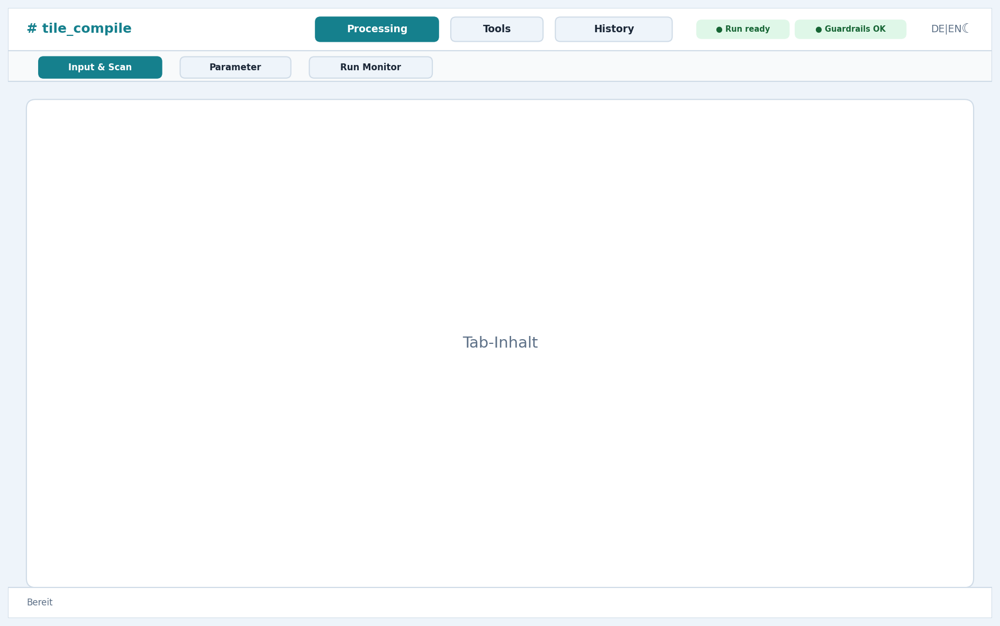
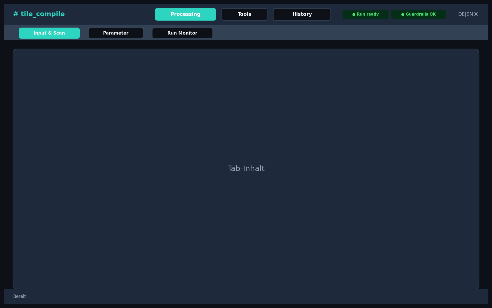

### 1.1 Hauptansicht

```
┌─────────────────────────────────────────────────────────────────────┐
│  # tile_compile          [ Processing ] [ Tools ] [ History ]      [DE|EN] [S]│
│  ● Run ready  ● Guardrails: OK                                      │
├─────────────────────────────────────────────────────────────────────┤
│                                                                     │
│  Sub-Tabs (kontextabhängig):                                        │
│  [ Input & Scan ]  [ Parameter ]  [ Run Monitor ]                  │
│                                                                     │
│  ┌─────────────────────────────────────────────────────────────┐   │
│  │                                                             │   │
│  │                  Tab-Inhalt                                 │   │
│  │                                                             │   │
│  └─────────────────────────────────────────────────────────────┘   │
│                                                                     │
└─────────────────────────────────────────────────────────────────────┘
```

### 1.2 Header-Detail

```
┌─────────────────────────────────────────────────────────────────────┐
│  ⬡ tile_compile                                    [DE|EN]  [☾/☀]  │
│  ┌─────────────┐  ┌──────────────┐                                 │
│  │ ● Run ready │  │ ● Guardrails │                                 │
│  └─────────────┘  └──────────────┘                                 │
└─────────────────────────────────────────────────────────────────────┘
```

- **Status-Chips**: Live aktualisiert (grün=OK, gelb=check, rot=error, blau=running)
- **☾/☀ Theme-Toggle**: Wechselt zwischen Light/Dark (persistiert in `uiStore`)
- **DE|EN**: Sprachumschalter (persistiert)

### 1.3 Sub-Tab-Leiste mit Guardrail-Indikatoren

```
  [ Input & Scan ● ]  [ Parameter ✅ ]  [ Run Monitor ⏸ ]
```

| Icon | Bedeutung |
|---|---|
| ● (blau) | Aktiv / Scan läuft |
| ✅ (grün) | Validiert / OK |
| ⚠️ (gelb) | Warnung / nicht validiert |
| ❌ (rot) | Fehler / Blockiert |
| ⏸ (grau) | Kein Run aktiv |

---

## 2. Tab 1: Processing – Input & Scan

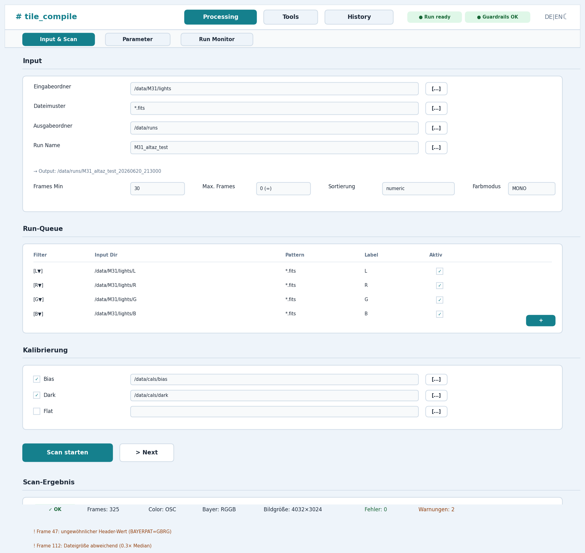
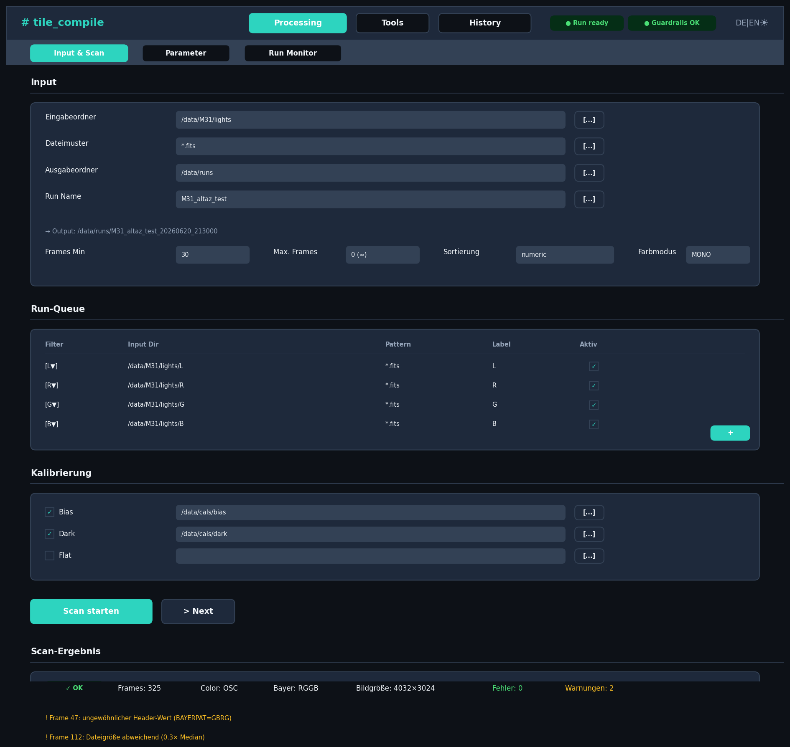

### 2.1 Layout

```
┌─────────────────────────────────────────────────────────────────────┐
│  Input & Scan                                                       │
├─────────────────────────────────────────────────────────────────────┤
│                                                                     │
│  ┌─ Input ────────────────────────────────────────────────────────┐ │
│  │                                                                │ │
│  │  Eingabeordner    [/data/M31/lights____________________] [📂] [+]│ │
│  │  Dateimuster       [*.fits__________]                          │ │
│  │  Ausgabeordner     [/data/runs_______________________] [📂]    │ │
│  │  Run Name          [M31_altaz_test_________________]           │ │
│  │  → Output: /data/runs/M31_altaz_test_20260620_213000           │ │
│  │                                                                │ │
│  │  Frames Minimum    [30___]   Max. Frames  [0___] (0=∞)        │ │
│  │  Sortierung        [numeric▼]                                  │ │
│  │  Farbmodus         [MONO▼]    Bayer-Pattern [auto▼]           │ │
│  │  ☐ Checksummen berechnen                                      │ │
│  └────────────────────────────────────────────────────────────────┘ │
│                                                                     │
│  ┌─ Run-Queue ────────────────────────────────────────────────────┐ │
│  │ Filter  │ Input Dir              │ Pattern    │ Label  │ Aktv  │ │
│  │─────────┼────────────────────────┼────────────┼────────┼───────│ │
│  │ [L▼]    │ /data/M31/lights/L     │ *.fits     │ L      │ [☑]   │ │
│  │ [R▼]    │ /data/M31/lights/R     │ *.fits     │ R      │ [☑]   │ │
│  │ [G▼]    │ /data/M31/lights/G     │ *.fits     │ G      │ [☑]   │ │
│  │ [B▼]    │ /data/M31/lights/B     │ *.fits     │ B      │ [☑]   │ │
│  │ [Ha▼]   │ /data/M31/lights/Ha    │ *.fits     │ Ha     │ [☑]   │ │
│  │                                                         [−]   │ │
│  └────────────────────────────────────────────────────────────────┘ │
│                                                                     │
│  ┌─ Kalibrierung ─────────────────────────────────────────────────┐ │
│  │                                                                │ │
│  │  ☑ Bias    [Bias-Ordner▼]  [/data/cals/bias____] [📂]        │ │
│  │  ☑ Dark    [Dark-Ordner▼]  [/data/cals/dark____] [📂]        │ │
│  │  ☐ Flat    [Flat-Ordner▼]  [_____________________] [📂]       │ │
│  │                                                                │ │
│  └────────────────────────────────────────────────────────────────┘ │
│                                                                     │
│  [ Scan starten ]                                         [▶ Next]  │
│                                                                     │
│  ┌─ Scan-Ergebnis ────────────────────────────────────────────────┐ │
│  │                                                                │ │
│  │  Status: ✓ OK     Frames: 325     Color: OSC     Bayer: RGGB  │ │
│  │  Bildgröße: 4032×3024    Mode-Kandidaten: OSC, MONO           │ │
│  │  Fehler: 0    Warnungen: 2                                     │ │
│  │                                                                │ │
│  │  ⚠ Frame 47: ungewöhnlicher Header-Wert (BAYERPAT=GBRG)       │ │
│  │  ⚠ Frame 112: Dateigröße abweichend (0.3× Median)             │ │
│  │                                                                │ │
│  └────────────────────────────────────────────────────────────────┘ │
│                                                                     │
└─────────────────────────────────────────────────────────────────────┘
```

### 2.2 Komponenten

| Komponente | Beschreibung |
|---|---|
| `PathInput` | Text-Input + Browse-Button (ruft `/api/fs/open`) |
| `QueueEditor` | Tabelle mit Filter, Input-Dir, Pattern, Label, Toggle |
| `CalibrationPanel` | 3 Reihen (Bias/Dark/Flat) mit Toggle, Source-Select, Path |
| `ScanResultCard` | Card mit Scan-Metadaten + Warning-Liste |
| `GuardrailBadges` | Status-Chips für Scan, ColorMode, Calibration |

### 2.3 Ablauf

```
User öffnet Processing-Tab
    │
    ├── Input-Dir eingeben / browsen
    ├── Queue-Einträge hinzufügen (+)
    ├── Kalibrierung konfigurieren
    │
    ├── "Scan starten" klick
    │   ├── POST /api/scan
    │   ├── Loading-State auf Button
    │   ├── Ergebnis anzeigen
    │   ├── Guardrails aktualisieren
    │   └── Toast: "Scan completed" oder "Scan failed"
    │
    └── "Next" → wechselt zu Parameter-Tab
```

---

## 3. Tab 1: Processing – Parameter + Assumptions

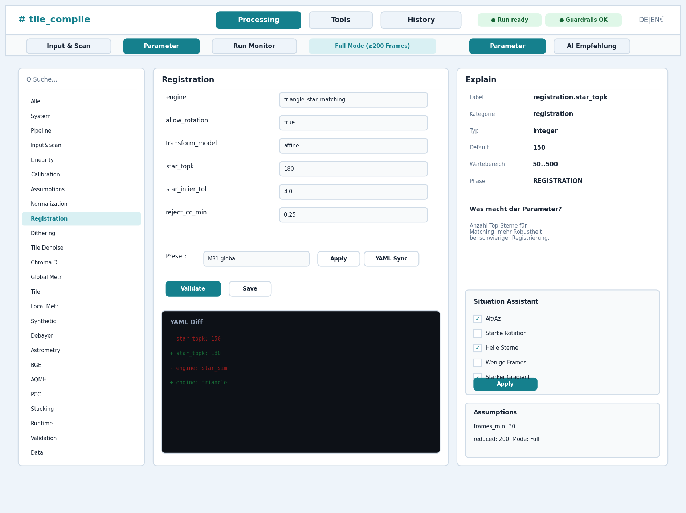
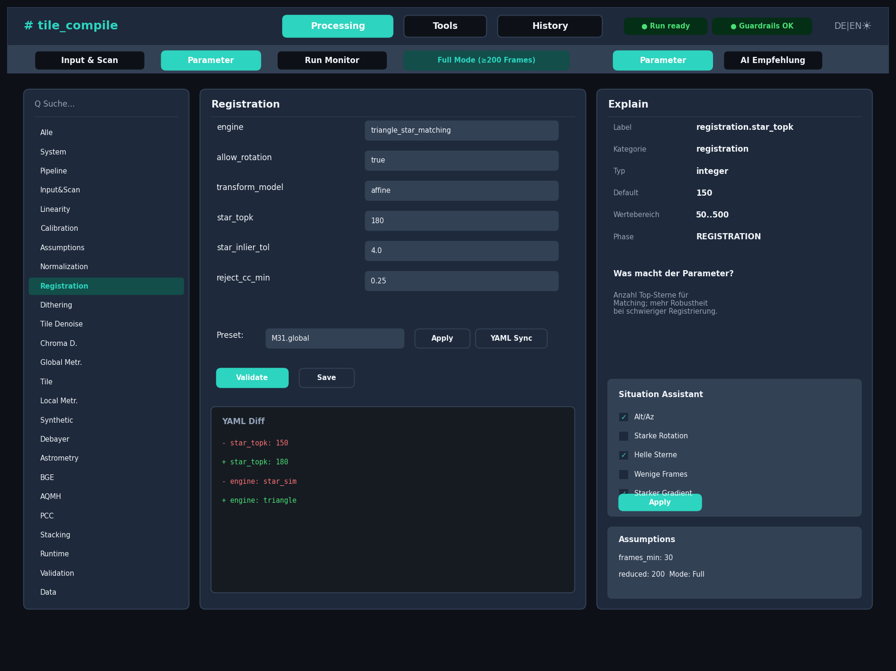

### 3.1 Layout – 3-Spalten

```
┌─────────────────────────────────────────────────────────────────────┐
│  Parameter                                                          │
│  Pipeline-Modus: [ Full Mode (≥200 Frames) ]   [ Parameter | AI ]  │
├─────────────────────────────────────────────────────────────────────┤
│                                                                     │
│  ┌─ Kategorien ──┐  ┌─ Editor ──────────────┐  ┌─ Explain ────────┐│
│  │               │  │                       │  │                  ││
│  │ 🔍 Suche...   │  │ Registration          │  │ Label            ││
│  │               │  │ ┌───────────────────┐ │  │ registration.    ││
│  │ • Alle        │  │ │ engine            │ │  │   star_topk      ││
│  │ • System      │  │ │ [triangle_star_   │ │  │                  ││
│  │ • Pipeline    │  │ │  matching▼]       │ │  │ Kategorie        ││
│  │ • Input&Scan  │  │ │                   │ │  │ registration     ││
│  │ • Linearity   │  │ │ allow_rotation    │ │  │                  ││
│  │ • Calibration │  │ │ [true▼]           │ │  │ Typ: integer     ││
│  │ • Assumptions │  │ │                   │ │  │ Default: 150     ││
│  │ • Normaliz.   │  │ │ transform_model   │ │  │ Range: 50..500   ││
│  │ • Registration│  │ │ [affine▼]         │ │  │ Phase: REGISTRATION│
│  │ • Dithering   │  │ │                   │ │  │                  ││
│  │ • Tile Denoise│  │ │ star_topk         │ │  │ Was macht der     ││
│  │ • Chroma D.   │  │ │ [180____]         │ │  │ Parameter?        ││
│  │ • Global Metr.│  │ │                   │ │  │ Anzahl Top-Sterne ││
│  │ • Tile        │  │ │ star_inlier_tol   │ │  │ für Matching...   ││
│  │ • Local Metr. │  │ │ [4.0____]         │ │  │                  ││
│  │ • Synthetic   │  │ │                   │ │  │ ┌─ Situation ────┐││
│  │ • Debayer     │  │ │ reject_cc_min     │ │  │ │ ☑ Alt/Az       │││
│  │ • Astrometry  │  │ │ [0.25___]         │ │  │ │ ☐ Rotation     │││
│  │ • BGE         │  │ └───────────────────┘ │  │ │ ☑ Bright Stars │││
│  │ • AQMH        │  │                       │  │ │ ☐ Few Frames   │││
│  │ • PCC         │  │ Preset: [M31.global▼] │  │ │ ☑ Gradient     │││
│  │ • Stacking    │  │ [Apply] [YAML Sync]   │  │ │                │││
│  │ • Runtime     │  │ [Validate] [Save]     │  │ │ [Apply]        │││
│  │ • Validation  │  │                       │  │ └────────────────┘││
│  │ • Data        │  │ ┌─ YAML Diff ────────┐ │  │                  ││
│  │               │  │ │ - star_topk: 150   │ │  │ ┌─ Assumptions ─┐││
│  │               │  │ │ + star_topk: 180   │ │  │ │ (in Kategorie  │││
│  │               │  │ │ - engine: star_sim │ │  │ │  Assumptions)  │││
│  │               │  │ │ + engine: triangle │ │  │ │ frames_min: 30 │││
│  │               │  │ └────────────────────┘ │  │ │ reduced: 200   │││
│  │               │  │                       │  │ │ Mode: Full     │││
│  └───────────────┘  └───────────────────────┘  └──────────────────┘│
│                                                                     │
└─────────────────────────────────────────────────────────────────────┘
```

### 3.2 Assumptions als Kategorie

Wenn "Assumptions" in der Kategorie-Liste gewählt wird:

```
┌─ Editor ──────────────────────────────────────────┐
│ Assumptions                                       │
│                                                   │
│  frames_min              [30___]                  │
│  frames_reduced_threshold [200__]                 │
│  reduced_mode_skip_clustering [true▼]             │
│  reduced_mode_cluster_range [[5, 10]___]          │
│                                                   │
│  ┌─ Pipeline-Modus ─────────────────────────────┐ │
│  │  ✅ Full Mode (≥ 200 Frames)                 │ │
│  │  Alle Pipeline-Phasen aktiv inkl. Clustering │ │
│  └──────────────────────────────────────────────┘ │
│                                                   │
└───────────────────────────────────────────────────┘
```

### 3.3 Explain-Panel Detail

```
┌─ Explain ──────────────────────────┐
│                                    │
│  Label                             │
│  registration.star_topk            │
│                                    │
│  Pfad                              │
│  registration.star_topk            │
│                                    │
│  Kategorie     Typ                 │
│  registration  integer             │
│                                    │
│  Default       Wertebereich        │
│  150           50..500             │
│                                    │
│  Phase                              │
│  REGISTRATION                       │
│                                    │
│  ──────────────────────────────     │
│                                    │
│  Was macht der Parameter?           │
│  Anzahl Top-Sterne für Matching;   │
│  mehr Robustheit bei schwieriger   │
│  Registrierung.                    │
│                                    │
│  ──────────────────────────────     │
│                                    │
│  Situation Assistant               │
│  ┌──────────────────────────────┐  │
│  │ ☑ Alt/Az                     │  │
│  │ ☐ Starke Rotation            │  │
│  │ ☑ Helle Sterne               │  │
│  │ ☐ Wenige Frames              │  │
│  │ ☑ Starker Gradient           │  │
│  └──────────────────────────────┘  │
│  [ Situation anwenden ]            │
│                                    │
│  ──────────────────────────────     │
│                                    │
│  YAML Diff (Preview)               │
│  ┌──────────────────────────────┐  │
│  │ - star_topk: 150             │  │
│  │ + star_topk: 200             │  │
│  │ - engine: star_similarity    │  │
│  │ + engine: triangle_star_match│  │
│  └──────────────────────────────┘  │
│                                    │
└────────────────────────────────────┘
```

### 3.4 Ablauf

```
User öffnet Parameter-Tab
    │
    ├── Preset wählen (optional) → lädt Config
    ├── Kategorie wählen → Editor zeigt Felder
    ├── Parameter bearbeiten
    │   ├── Explain-Panel zeigt Metadaten bei Fokus
    │   ├── Situation Assistant wählbar
    │   └── YAML-Diff aktualisiert sich live
    │
    ├── "Validate" klick
    │   ├── POST /api/config/validate
    │   ├── Ergebnis: ✅ OK oder ⚠️ Warnings oder ❌ Errors
    │   └── Guardrail-Badge aktualisiert
    │
    ├── "Save" klick
    │   ├── POST /api/config/save
    │   ├── Neue Revision erstellt
    │   └── Toast: "Config saved as revision N"
    │
    └── "Next" → wechselt zu Run Monitor
```

---

## 4. Tab 1: Processing – AI Empfehlung

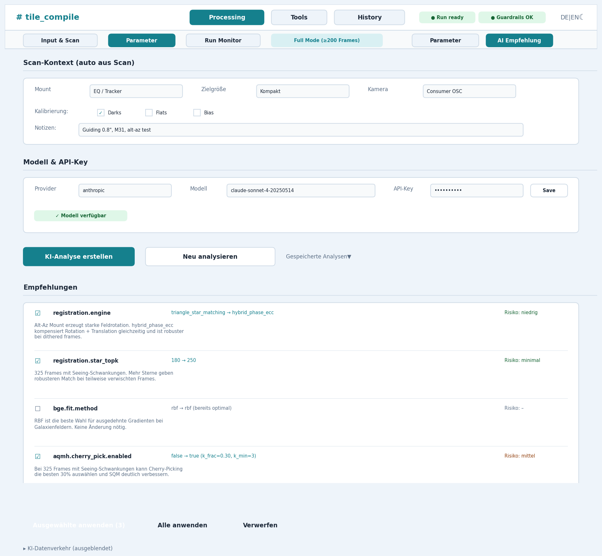
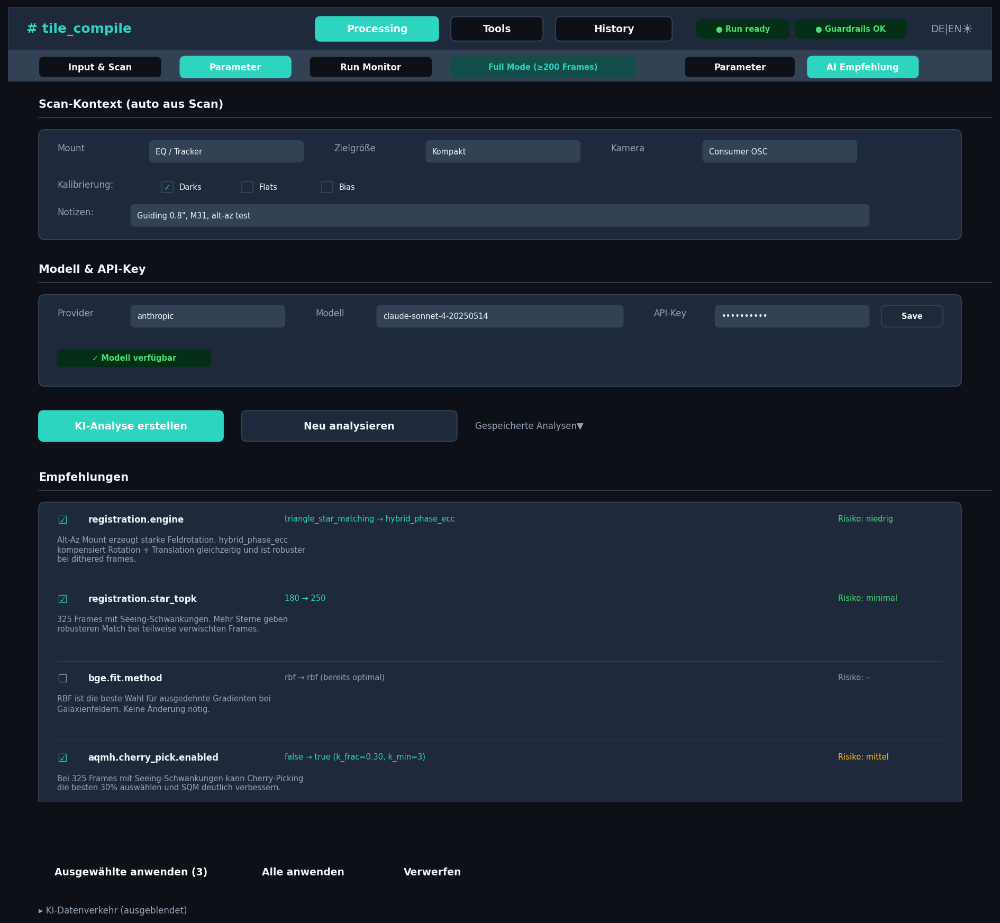

### 4.1 Layout

```
┌─────────────────────────────────────────────────────────────────────┐
│  Parameter                                                          │
│  Pipeline-Modus: [ Full Mode ]     [ Parameter | ▸ AI Empfehlung ] │
├─────────────────────────────────────────────────────────────────────┤
│                                                                     │
│  ┌─ Scan-Kontext (auto aus Scan) ─────────────────────────────────┐ │
│  │                                                                │ │
│  │  Mount         [EQ / Tracker▼]                                 │ │
│  │  Zielgröße     [Kompakt▼]      Kamera    [Consumer OSC▼]      │ │
│  │  Kalibrierung  ☑ Darks  ☐ Flats  ☐ Bias                     │ │
│  │  Notizen       [Guiding 0.8", M31, alt-az test_____________]  │ │
│  │                                                                │ │
│  └────────────────────────────────────────────────────────────────┘ │
│                                                                     │
│  ┌─ Modell & API-Key ─────────────────────────────────────────────┐ │
│  │                                                                │ │
│  │  Provider  [anthropic▼]   Modell  [claude-sonnet-4-20250514▼] │ │
│  │  API-Key   [••••••••••••]  [Key speichern]  ✓ gespeichert      │ │
│  │  Status: ✓ Modell verfügbar                                   │ │
│  │                                                                │ │
│  └────────────────────────────────────────────────────────────────┘ │
│                                                                     │
│  [ KI-Analyse erstellen ]  [ Neu analysieren (Cache ignorieren) ]  │
│  [ Gespeicherte Analysen▼ ]                                        │
│                                                                     │
│  ┌─ Empfehlungen ─────────────────────────────────────────────────┐ │
│  │                                                                │ │
│  │  ☑ registration.engine                                         │ │
│  │     Aktuell: triangle_star_matching                            │ │
│  │     Empfohlen: hybrid_phase_ecc                                │ │
│  │     Begründung: Alt-Az Mount erzeugt starke Feldrotation.      │ │
│  │     hybrid_phase_ecc kompensiert Rotation + Translation        │ │
│  │     gleichzeitig und ist robuster bei dithered frames.         │ │
│  │     Risiko: niedrig – Fallback auf triangle bei Misserfolg.    │ │
│  │                                                                │ │
│  │  ────────────────────────────────────────────────────────────  │ │
│  │                                                                │ │
│  │  ☑ registration.star_topk                                     │ │
│  │     Aktuell: 180                                               │ │
│  │     Empfohlen: 250                                             │ │
│  │     Begründung: 325 Frames mit Seeing-Schwankungen. Mehr       │ │
│  │     Sterne geben robusteren Match bei teilweise verwischten    │ │
│  │     Frames. Risiko: minimal, leicht längere Match-Zeit.        │ │
│  │                                                                │ │
│  │  ────────────────────────────────────────────────────────────  │ │
│  │                                                                │ │
│  │  ☐ bge.fit.method                                             │ │
│  │     Aktuell: rbf                                               │ │
│  │     Empfohlen: rbf (bereits optimal)                           │ │
│  │     Begründung: RBF ist die beste Wahl für ausgedehnte         │ │
│  │     Gradienten bei Galaxienfeldern. Keine Änderung nötig.      │ │
│  │                                                                │ │
│  │  ────────────────────────────────────────────────────────────  │ │
│  │                                                                │ │
│  │  ☑ aqmh.cherry_pick.enabled                                   │ │
│  │     Aktuell: false                                             │ │
│  │     Empfohlen: true (k_frac=0.30, k_min=3)                    │ │
│  │     Begründung: Bei 325 Frames mit Seeing-Schwankungen kann    │ │
│  │     Cherry-Picking die besten 30% auswählen und SQM deutlich   │ │
│  │     verbessern. Risiko: mittel – reduziert Stack-Tiefe.        │ │
│  │                                                                │ │
│  └────────────────────────────────────────────────────────────────┘ │
│                                                                     │
│  [ Ausgewählte anwenden (2) ]  [ Alle anwenden ]  [ Verwerfen ]    │
│                                                                     │
│  ▸ KI-Datenverkehr (ausgeblendet)                                   │
│                                                                     │
└─────────────────────────────────────────────────────────────────────┘
```

### 4.2 KI-Datenverkehr (aufgeklappt)

```
▼ KI-Datenverkehr
┌──────────────────────────────────────────────────────────────────┐
│                                                                  │
│  Request 1                        21:30:15                       │
│  POST /api/scan/analysis                                         │
│  Model: claude-sonnet-4-20250514                                 │
│  Tokens: 1.247 input / 892 output                               │
│  Duration: 4.2s                                                  │
│  Status: ✓ OK                                                    │
│  [ Vollständige Antwort anzeigen... ]                            │
│                                                                  │
│  Request 2                        21:28:02                       │
│  GET /api/scan/analysis/latest                                   │
│  Status: ✓ OK (cached)                                           │
│                                                                  │
└──────────────────────────────────────────────────────────────────┘
```

### 4.3 Ablauf

```
User wechselt zu "AI Empfehlung" Sub-Tab
    │
    ├── Scan-Kontext wird automatisch aus scanStore geladen
    │   (falls Scan durchgeführt wurde)
    │
    ├── Modell wählen + API-Key eingeben
    │   ├── POST /api/ai/auth/{provider} (Key speichern)
    │   └── GET /api/ai/models (verfügbare Modelle)
    │
    ├── "KI-Analyse erstellen" klick
    │   ├── Loading-State (Spinner, "Analysiere...")
    │   ├── POST /api/scan/analysis (mit Kontext)
    │   ├── Ergebnis wird gerendert
    │   │   ├── Pro Empfehlung: Checkbox, Parameter, aktuell→empfohlen
    │   │   ├── Begründungstext
    │   │   └── Risiko-Bewertung
    │   └── Toast: "KI-Analyse verfügbar" oder "Fehler"
    │
    ├── Empfehlungen selektieren (Checkboxen)
    │
    ├── "Ausgewählte anwenden" klick
    │   ├── POST /api/config/patch (mit ausgewählten Änderungen)
    │   ├── Config wird aktualisiert
    │   ├── YAML-Diff im Parameter-Tab aktualisiert
    │   ├── Validierung läuft automatisch
    │   └── Toast: "2 Empfehlungen angewendet"
    │
    └── User wechselt zurück zu "Parameter" Tab
        → sieht angewendete Änderungen im YAML-Diff
        → kann weitere Anpassungen machen
```

---

## 5. Tab 1: Processing – Run Monitor

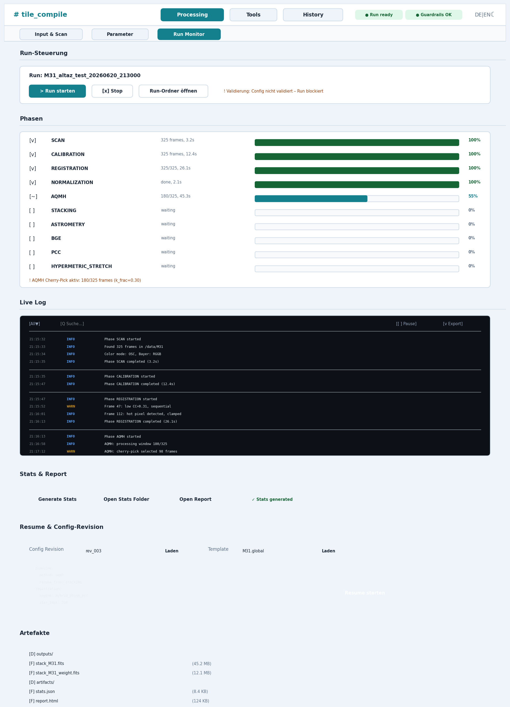
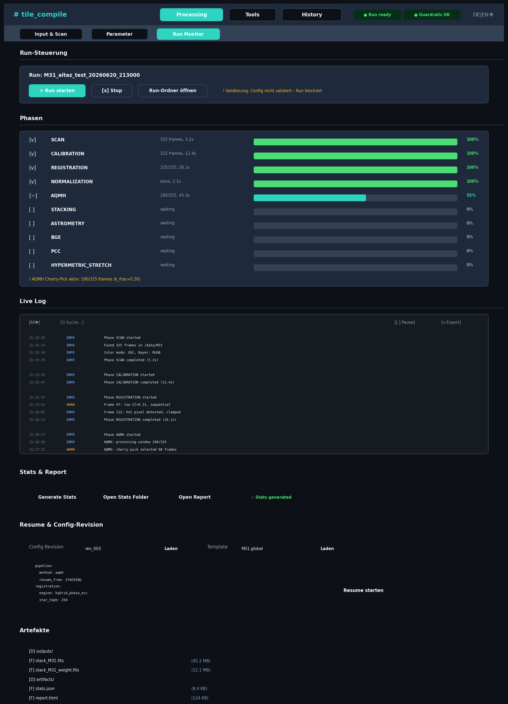

### 5.1 Layout

```
┌─────────────────────────────────────────────────────────────────────┐
│  Run Monitor                                                        │
├─────────────────────────────────────────────────────────────────────┤
│                                                                     │
│  ┌─ Run-Steuerung ────────────────────────────────────────────────┐ │
│  │  Run: M31_altaz_test_20260620_213000                           │ │
│  │  [ ▶ Run starten ]  [ ⏹ Stop ]  [ Run-Ordner öffnen ]         │ │
│  │  ⚠ Validierung: Config nicht validiert – Run blockiert         │ │
│  └────────────────────────────────────────────────────────────────┘ │
│                                                                     │
│  ┌─ Phasen ──────────────────────────────────────────────────────┐ │
│  │                                                               │ │
│  │  ✅ SCAN              325 frames    3.2s          100%        │ │
│  │  ✅ CALIBRATION       325 frames    12.4s         100%        │ │
│  │  ✅ REGISTRATION      325/325       26.1s         100%        │ │
│  │  ✅ NORMALIZATION     done           2.1s         100%        │ │
│  │  🔄 AQMH              180/325        45.3s         55%        │ │
│  │     ┌──────────────────────────────────────┐                   │ │
│  │     │█████████████████░░░░░░░░░░░░░░░░░░░░│  55%              │ │
│  │     └──────────────────────────────────────┘                   │ │
│  │  ⏸ STACKING           waiting                       0%        │ │
│  │  ⏸ ASTROMETRY         waiting                       0%        │ │
│  │  ⏸ BGE                waiting                       0%        │ │
│  │  ⏸ PCC                waiting                       0%        │ │
│  │  ⏸ HYPERMETRIC_STRETCH waiting                      0%        │ │
│  │                                                               │ │
│  │  ⚠ AQMH Cherry-Pick aktiv: 180/325 frames (k_frac=0.30)      │ │
│  │                                                               │ │
│  └───────────────────────────────────────────────────────────────┘ │
│                                                                     │
│  ┌─ Live Log ────────────────────────────────────────────────────┐ │
│  │  [All▼] [🔍 Suche...]  [⏸ Pause]  [⬇ Export]                 │ │
│  │  ┌─────────────────────────────────────────────────────────┐  │ │
│  │  │                                                         │  │ │
│  │  │ 21:15:32 INFO   Phase SCAN started                     │  │ │
│  │  │ 21:15:33 INFO   Found 325 frames in /data/M31           │  │ │
│  │  │ 21:15:34 INFO   Color mode: OSC, Bayer: RGGB           │  │ │
│  │  │ 21:15:35 INFO   Phase SCAN completed (3.2s)             │  │ │
│  │  │ ─────────────────────────────────────────────────────── │  │ │
│  │  │ 21:15:35 INFO   Phase CALIBRATION started               │  │ │
│  │  │ 21:15:47 INFO   Phase CALIBRATION completed (12.4s)     │  │ │
│  │  │ ─────────────────────────────────────────────────────── │  │ │
│  │  │ 21:15:47 INFO   Phase REGISTRATION started              │  │ │
│  │  │ 21:15:52 WARN   Frame 47: low CC=0.31, sequential       │  │ │
│  │  │ 21:16:01 INFO   Frame 112: hot pixel detected, clamped  │  │ │
│  │  │ 21:16:13 INFO   Phase REGISTRATION completed (26.1s)    │  │ │
│  │  │ ─────────────────────────────────────────────────────── │  │ │
│  │  │ 21:16:13 INFO   Phase AQMH started                      │  │ │
│  │  │ 21:16:58 INFO   AQMH: processing window 180/325         │  │ │
│  │  │ 21:17:12 WARN   AQMH: cherry-pick selected 98 frames    │  │ │
│  │  │                                                         │  │ │
│  │  └─────────────────────────────────────────────────────────┘  │ │
│  └───────────────────────────────────────────────────────────────┘ │
│                                                                     │
│  ┌─ Stats & Report ──────────────────────────────────────────────┐ │
│  │  [ Generate Stats ]  [ Open Stats Folder ]  [ Open Report ]   │ │
│  │  Status: ✓ Stats generated                                     │ │
│  └───────────────────────────────────────────────────────────────┘ │
│                                                                     │
│  ┌─ Resume & Config-Revision ────────────────────────────────────┐ │
│  │                                                               │ │
│  │  Config Revision  [rev_003▼]  [ Revision laden ]             │ │
│  │  Template          [M31.global▼]  [ Template laden ]         │ │
│  │  Template Dir      [/data/presets__________] [📂] [Reload]   │ │
│  │                                                               │ │
│  │  ┌─ Resume Config (YAML) ──────────────────────────────────┐ │ │
│  │  │ pipeline:                                               │ │ │
│  │  │   method: aqmh                                          │ │ │
│  │  │   resume_from: STACKING                                 │ │ │
│  │  │ registration:                                           │ │ │
│  │  │   engine: hybrid_phase_ecc                              │ │ │
│  │  │   star_topk: 250                                        │ │ │
│  │  │ ...                                                     │ │ │
│  │  └─────────────────────────────────────────────────────────┘ │ │
│  │                                                               │ │
│  │  [ Resume starten ]                                           │ │
│  │                                                               │ │
│  └───────────────────────────────────────────────────────────────┘ │
│                                                                     │
│  ┌─ Artefakte ───────────────────────────────────────────────────┐ │
│  │  📁 outputs/                                                  │ │
│  │    📄 stack_M31.fits              (45.2 MB)   [Anzeigen]      │ │
│  │    📄 stack_M31_weight.fits        (12.1 MB)                  │ │
│  │  📁 artifacts/                                                │ │
│  │    📄 stats.json                   (8.4 KB)    [Anzeigen]     │ │
│  │    📄 report.html                  (124 KB)    [Öffnen]       │ │
│  │    📄 registration_log.txt         (2.1 MB)    [Anzeigen]     │ │
│  │  📁 registered/                                               │ │
│  │    📄 reg_0001.fits                (8.1 MB)                   │ │
│  │    ...                                                        │ │
│  └───────────────────────────────────────────────────────────────┘ │
│                                                                     │
└─────────────────────────────────────────────────────────────────────┘
```

### 5.2 Artefakt-Viewer (Modal)

```
┌──────────────────────────────────────────────────────────────┐
│  stats.json                                       [ Schließen ]│
├──────────────────────────────────────────────────────────────┤
│                                                              │
│  {                                                          │
│    "run_id": "M31_altaz_test_20260620_213000",             │
│    "phases": {                                              │
│      "scan": { "duration_s": 3.2, "frames": 325 },        │
│      "registration": {                                     │
│        "duration_s": 26.1,                                 │
│        "direct_global": 97,                                │
│        "sequential_refined": 227,                          │
│        "reference_frame": 256                              │
│      },                                                     │
│      ...                                                    │
│    }                                                        │
│  }                                                          │
│                                                              │
└──────────────────────────────────────────────────────────────┘
```

### 5.3 Ablauf

```
User öffnet Run Monitor Tab
    │
    ├── Auto-Load: aktueller Run aus uiState
    │   ├── GET /api/runs/{runId}/status
    │   ├── WebSocket: /api/ws/runs/{runId}
    │   └── Phasen + Log werden live aktualisiert
    │
    ├── "Run starten" klick
    │   ├── Validierung prüfen (Guardrail)
    │   ├── POST /api/runs/start
    │   ├── WebSocket verbinden
    │   └── Phasen + Log aktualisieren
    │
    ├── "Stop" klick
    │   ├── POST /api/runs/{runId}/stop
    │   └── Phasen-Status aktualisiert
    │
    ├── Phasen-Klick (nach Run-Ende)
    │   └── Setzt Resume-Phase im Resume-Panel
    │
    ├── "Generate Stats" klick
    │   ├── POST /api/runs/{runId}/stats
    │   ├── Polling bis fertig
    │   └── "Open Report" wird enabled
    │
    ├── "Resume starten" klick
    │   ├── POST /api/runs/{runId}/resume
    │   ├── WebSocket verbinden
    │   └── Phasen + Log aktualisieren
    │
    └── Artefakt-Klick
        └── Modal mit Inhalt (JSON, Text, oder Link)
```

---

## 6. Tab 2: Tools – Raw Stack

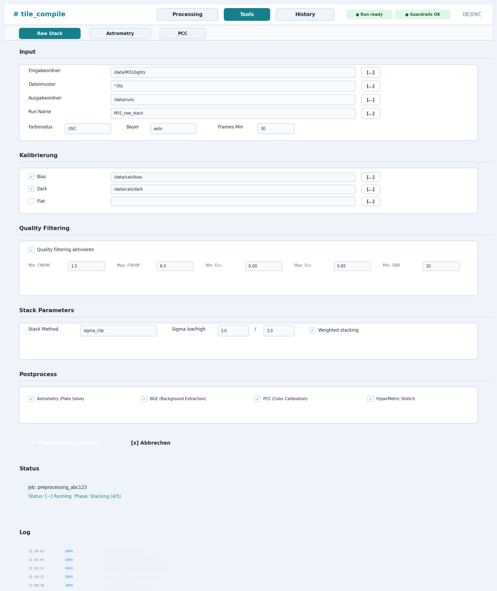
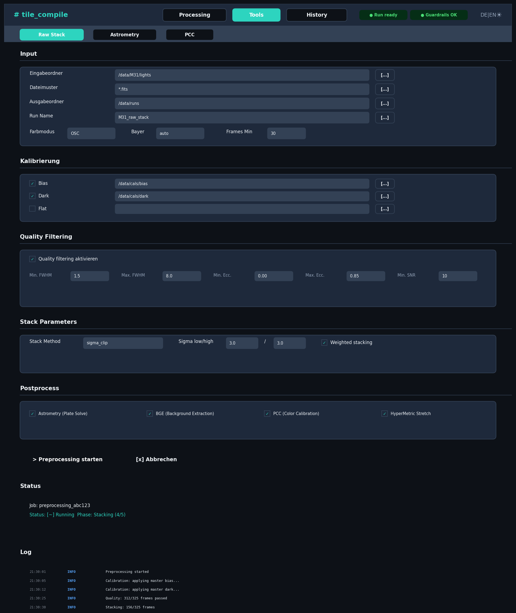

### 6.1 Layout

```
┌─────────────────────────────────────────────────────────────────────┐
│  Raw Stack                                                          │
├─────────────────────────────────────────────────────────────────────┤
│                                                                     │
│  ┌─ Input ────────────────────────────────────────────────────────┐│
│  │                                                                ││
│  │  Eingabeordner    [/data/M31/lights____________________] [📂]  ││
│  │  Dateimuster       [*.fits__________]                         ││
│  │  Ausgabeordner     [/data/runs_______________________] [📂]   ││
│  │  Run Name          [M31_raw_stack____________________]        ││
│  │  Frames Minimum    [30___]   Max. Frames  [0___]              ││
│  │  Farbmodus         [OSC▼]    Bayer-Pattern [auto▼]            ││
│  │                                                                ││
│  └────────────────────────────────────────────────────────────────┘│
│                                                                     │
│  ┌─ Kalibrierung ─────────────────────────────────────────────────┐│
│  │  ☑ Bias    [/data/cals/bias____] [📂]                        ││
│  │  ☑ Dark    [/data/cals/dark____] [📂]                        ││
│  │  ☐ Flat    [_____________________] [📂]                       ││
│  └────────────────────────────────────────────────────────────────┘│
│                                                                     │
│  ┌─ Quality Filtering ────────────────────────────────────────────┐│
│  │  ☑ Quality filtering aktivieren                                ││
│  │  Min. FWHM         [1.5___]   Max. FWHM        [8.0___]       ││
│  │  Min. Eccentricity [0.00__]   Max. Eccentricity [0.85__]     ││
│  │  Min. SNR          [10___]                                    ││
│  └────────────────────────────────────────────────────────────────┘│
│                                                                     │
│  ┌─ Stack Parameters ─────────────────────────────────────────────┐│
│  │  Stack Method      [sigma_clip▼]                               ││
│  │  Sigma (low/high)  [3.0] / [3.0]                              ││
│  │  ☑ Weighted stacking                                           ││
│  └────────────────────────────────────────────────────────────────┘│
│                                                                     │
│  ┌─ Postprocess ──────────────────────────────────────────────────┐│
│  │  ☑ Astrometry (Plate Solve)                                    ││
│  │  ☑ BGE (Background Extraction)                                 ││
│  │  ☑ PCC (Color Calibration)                                     ││
│  │  ☑ HyperMetric Stretch                                         ││
│  └────────────────────────────────────────────────────────────────┘│
│                                                                     │
│  [ ▶ Preprocessing starten ]  [ ⏹ Abbrechen ]                      ││
│                                                                     │
│  ┌─ Status ───────────────────────────────────────────────────────┐│
│  │  Job: preprocessing_abc123                                     ││
│  │  Status: 🔄 Running                                            ││
│  │  Phase: Stacking (4/5)                                        ││
│  │  ████████████████████░░░░░  80%                               ││
│  └────────────────────────────────────────────────────────────────┘│
│                                                                     │
│  ┌─ Log ──────────────────────────────────────────────────────────┐│
│  │  [All▼]  [🔍 Suche...]                                        ││
│  │  21:30:01 INFO   Preprocessing started                        ││
│  │  21:30:05 INFO   Calibration: applying master bias...         ││
│  │  21:30:12 INFO   Calibration: applying master dark...         ││
│  │  21:30:25 INFO   Quality: 312/325 frames passed               ││
│  │  21:30:30 INFO   Stacking: 156/325 frames                     ││
│  └────────────────────────────────────────────────────────────────┘│
│                                                                     │
└─────────────────────────────────────────────────────────────────────┘
```

### 6.2 Ablauf

```
User öffnet Tools Tab → Raw Stack Sub-Tab
    │
    ├── Input + Kalibrierung konfigurieren (wie Input & Scan)
    ├── Quality + Stack Parameter setzen
    ├── Postprocess-Optionen wählen
    │
    ├── "Preprocessing starten" klick
    │   ├── POST /api/tools/preprocessing/run
    │   ├── Job-ID speichern
    │   ├── Polling: GET /api/tools/preprocessing/status?job_id=...
    │   ├── Progress + Log aktualisieren
    │   └── Toast bei Abschluss
    │
    ├── "Abbrechen" klick
    │   └── POST /api/tools/preprocessing/cancel
    │
    └── Nach Abschluss:
        ├── GET /api/tools/preprocessing/report?job_id=...
        └── Report anzeigen oder herunterladen
```

---

## 7. Tab 2: Tools – Astrometry

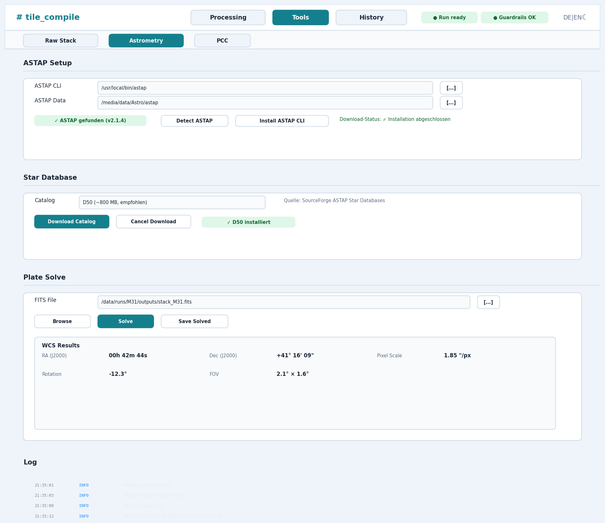
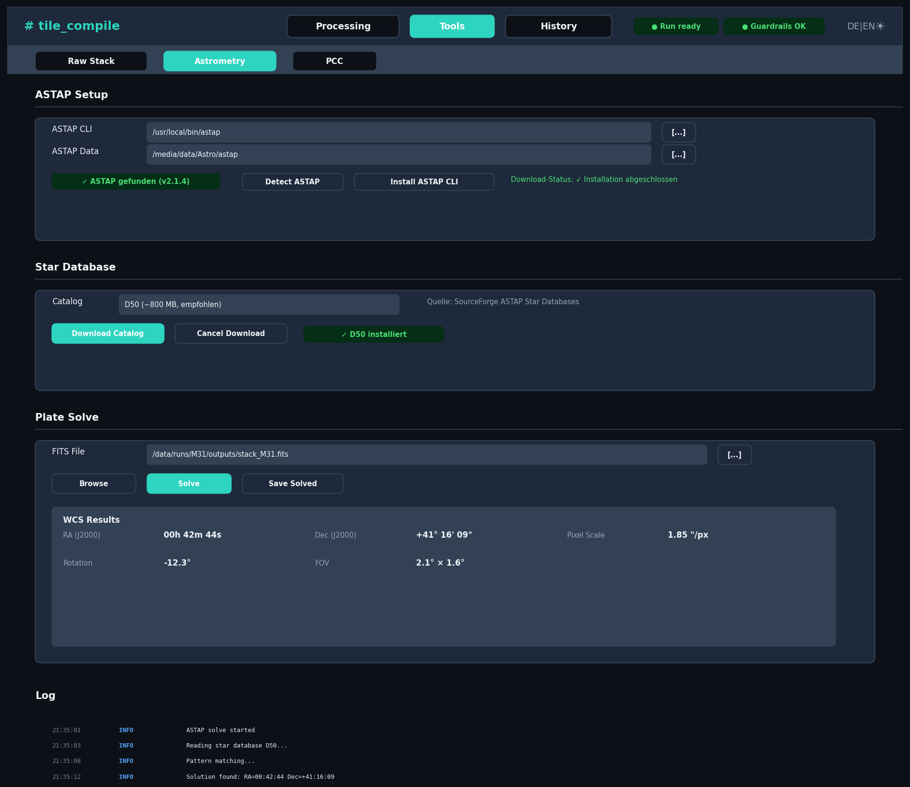

### 7.1 Layout

```
┌─────────────────────────────────────────────────────────────────────┐
│  Astrometry                                                         │
├─────────────────────────────────────────────────────────────────────┤
│                                                                     │
│  ┌─ ASTAP Setup ──────────────────────────────────────────────────┐│
│  │                                                                ││
│  │  ASTAP CLI     [/usr/local/bin/astap___________] [📂]        ││
│  │  ASTAP Data    [/media/data/Astro/astap________] [📂]        ││
│  │  Status        ✓ ASTAP gefunden (v2.1.4)                      ││
│  │                                                                ││
│  │  [ Detect ASTAP ]  [ Install/Reinstall ASTAP CLI ]            ││
│  │  Download-Status: ✓ Installation abgeschlossen                ││
│  │                                                                ││
│  └────────────────────────────────────────────────────────────────┘│
│                                                                     │
│  ┌─ Star Database ────────────────────────────────────────────────┐│
│  │                                                                ││
│  │  Catalog  [D50 (~800 MB, empfohlen)▼]                         ││
│  │  Quelle: SourceForge ASTAP Star Databases                     ││
│  │                                                                ││
│  │  [ Download Catalog ]  [ Cancel Download ]                    ││
│  │  Status: ✓ D50 installiert                                    ││
│  │                                                                ││
│  └────────────────────────────────────────────────────────────────┘│
│                                                                     │
│  ┌─ Plate Solve ──────────────────────────────────────────────────┐│
│  │                                                                ││
│  │  FITS File  [/data/runs/M31/outputs/stack_M31.fits] [📂]     ││
│  │                                                                ││
│  │  [ Browse ]  [ Solve ]  [ Save Solved ]                       ││
│  │                                                                ││
│  │  ┌─ WCS Results ──────────────────────────────────────────┐   ││
│  │  │                                                        │   ││
│  │  │  RA (J2000)      Dec (J2000)     Pixel Scale           │   ││
│  │  │  00h 42m 44s     +41° 16' 09"    1.85 "/px             │   ││
│  │  │                                                        │   ││
│  │  │  Rotation         FOV                                    │   ││
│  │  │  -12.3°           2.1° × 1.6°                           │   ││
│  │  │                                                        │   ││
│  │  └────────────────────────────────────────────────────────┘   ││
│  │                                                                ││
│  └────────────────────────────────────────────────────────────────┘│
│                                                                     │
│  ┌─ Log ──────────────────────────────────────────────────────────┐│
│  │  21:35:01 INFO   ASTAP solve started                          ││
│  │  21:35:03 INFO   Reading star database D50...                 ││
│  │  21:35:08 INFO   Pattern matching...                          ││
│  │  21:35:12 INFO   Solution found: RA=00:42:44 Dec=+41:16:09   ││
│  └────────────────────────────────────────────────────────────────┘│
│                                                                     │
└─────────────────────────────────────────────────────────────────────┘
```

### 7.2 Ablauf

```
User öffnet Tools Tab → Astrometry Sub-Tab
    │
    ├── ASTAP Setup
    │   ├── Pfad eingeben / browsen
    │   ├── "Detect ASTAP" → GET /api/tools/astrometry/detect
    │   └── "Install" → POST /api/tools/astrometry/install-cli (Job polling)
    │
    ├── Star Database
    │   ├── Catalog wählen
    │   ├── "Download" → POST /api/tools/astrometry/catalog/download
    │   ├── Polling bis fertig
    │   └── "Cancel" → POST /api/tools/astrometry/catalog/cancel
    │
    └── Plate Solve
        ├── FITS-Datei wählen
        ├── "Solve" → POST /api/tools/astrometry/solve
        ├── WCS-Results anzeigen
        └── "Save Solved" → POST /api/tools/astrometry/save-solved
```

---

## 8. Tab 2: Tools – PCC

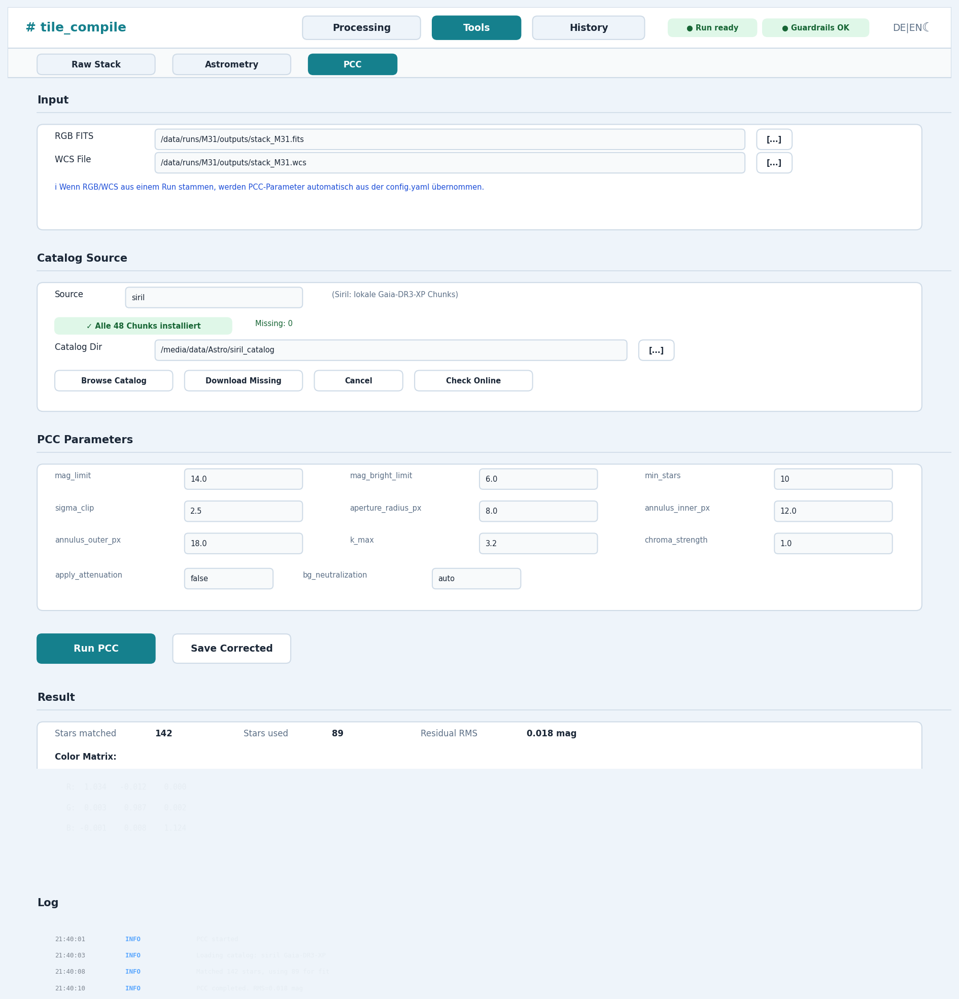
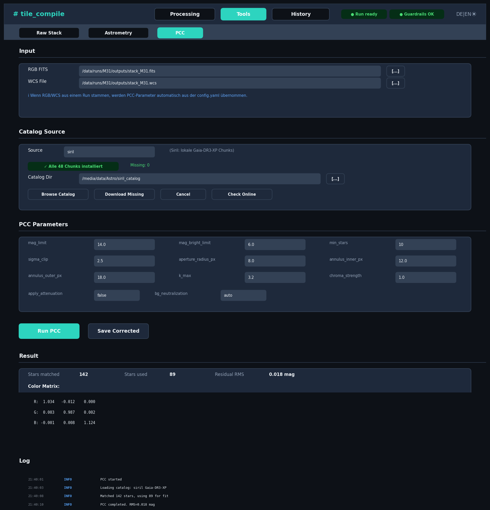

### 8.1 Layout

```
┌─────────────────────────────────────────────────────────────────────┐
│  PCC                                                                │
├─────────────────────────────────────────────────────────────────────┤
│                                                                     │
│  ┌─ Input ────────────────────────────────────────────────────────┐│
│  │                                                                ││
│  │  RGB FITS  [/data/runs/M31/outputs/stack_M31.fits] [📂]      ││
│  │  WCS File  [/data/runs/M31/outputs/stack_M31.wcs]  [📂]      ││
│  │                                                                ││
│  │  ℹ Wenn RGB/WCS aus einem Run stammen, werden PCC-Parameter   ││
│  │    automatisch aus der config.yaml übernommen.                 ││
│  │                                                                ││
│  └────────────────────────────────────────────────────────────────┘│
│                                                                     │
│  ┌─ Catalog Source ───────────────────────────────────────────────┐│
│  │                                                                ││
│  │  Source  [siril▼]  (Siril: lokale Gaia-DR3-XP Chunks)         ││
│  │          [vizier_gaia▼]  (Online: direkte VizieR-Abfrage)     ││
│  │          [vizier_apass▼]                                      ││
│  │                                                                ││
│  │  Siril Status     ✓ Alle 48 Chunks installiert                 ││
│  │  Missing Chunks   0                                            ││
│  │  Catalog Dir      [/media/data/Astro/siril_catalog] [📂]     ││
│  │                                                                ││
│  │  [ Browse Catalog Dir ]  [ Download Missing ]  [ Cancel ]     ││
│  │  [ Check Online Source ]                                      ││
│  │                                                                ││
│  └────────────────────────────────────────────────────────────────┘│
│                                                                     │
│  ┌─ PCC Parameters ───────────────────────────────────────────────┐│
│  │                                                                ││
│  │  mag_limit          [14.0_]    mag_bright_limit  [6.0_]      ││
│  │  min_stars          [10___]    sigma_clip         [2.5_]     ││
│  │  aperture_radius_px [8.0__]    annulus_inner_px   [12.0]     ││
│  │  annulus_outer_px   [18.0_]    k_max              [3.2_]     ││
│  │  chroma_strength    [1.0__]                                   ││
│  │  apply_attenuation  [false▼]                                  ││
│  │  bg_neutralization  [auto▼]                                   ││
│  │                                                                ││
│  └────────────────────────────────────────────────────────────────┘│
│                                                                     │
│  [ Run PCC ]  [ Save Corrected ]                                    │
│                                                                     │
│  ┌─ Result ───────────────────────────────────────────────────────┐│
│  │                                                                ││
│  │  Stars matched    142          Stars used    89               ││
│  │  Residual RMS     0.018 mag                                   ││
│  │                                                                ││
│  │  Color Matrix:                                                 ││
│  │  ┌────────────────────────────────────────────────────────┐   ││
│  │  │  R:  1.034   -0.012    0.000                            │   ││
│  │  │  G:  0.003    0.987    0.002                            │   ││
│  │  │  B: -0.001    0.008    1.124                            │   ││
│  │  └────────────────────────────────────────────────────────┘   ││
│  │                                                                ││
│  └────────────────────────────────────────────────────────────────┘│
│                                                                     │
│  ┌─ Log ──────────────────────────────────────────────────────────┐│
│  │  21:40:01 INFO   PCC started                                  ││
│  │  21:40:03 INFO   Loading catalog: siril Gaia-DR3-XP          ││
│  │  21:40:08 INFO   Matched 142 stars, using 89 for fit         ││
│  │  21:40:10 INFO   PCC completed. RMS=0.018 mag                ││
│  └────────────────────────────────────────────────────────────────┘│
│                                                                     │
└─────────────────────────────────────────────────────────────────────┘
```

### 8.2 Ablauf

```
User öffnet Tools Tab → PCC Sub-Tab
    │
    ├── Input: RGB + WCS Datei wählen
    │   ├── Wenn aus Run → Parameter auto-laden aus config.yaml
    │   └── Hint anzeigen
    │
    ├── Catalog Source wählen
    │   ├── Siril: Status checken, fehlende Chunks downloaden
    │   └── Online: Check Online Source
    │
    ├── PCC Parameter einstellen (oder Defaults übernehmen)
    │
    ├── "Run PCC" klick
    │   ├── POST /api/tools/pcc/run
    │   ├── Loading-State
    │   ├── Result anzeigen (Stars, RMS, Matrix)
    │   └── Log aktualisieren
    │
    └── "Save Corrected" klick
        └── POST /api/tools/pcc/save-corrected
```

---

## 9. Tab 3: History – Run History

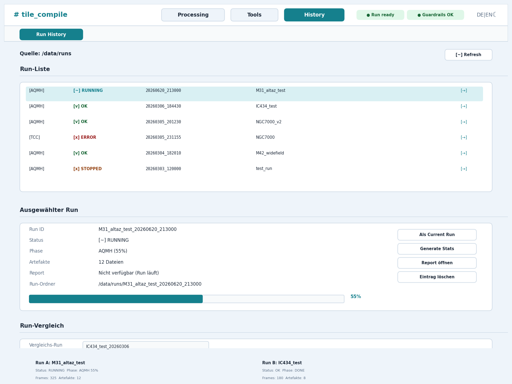
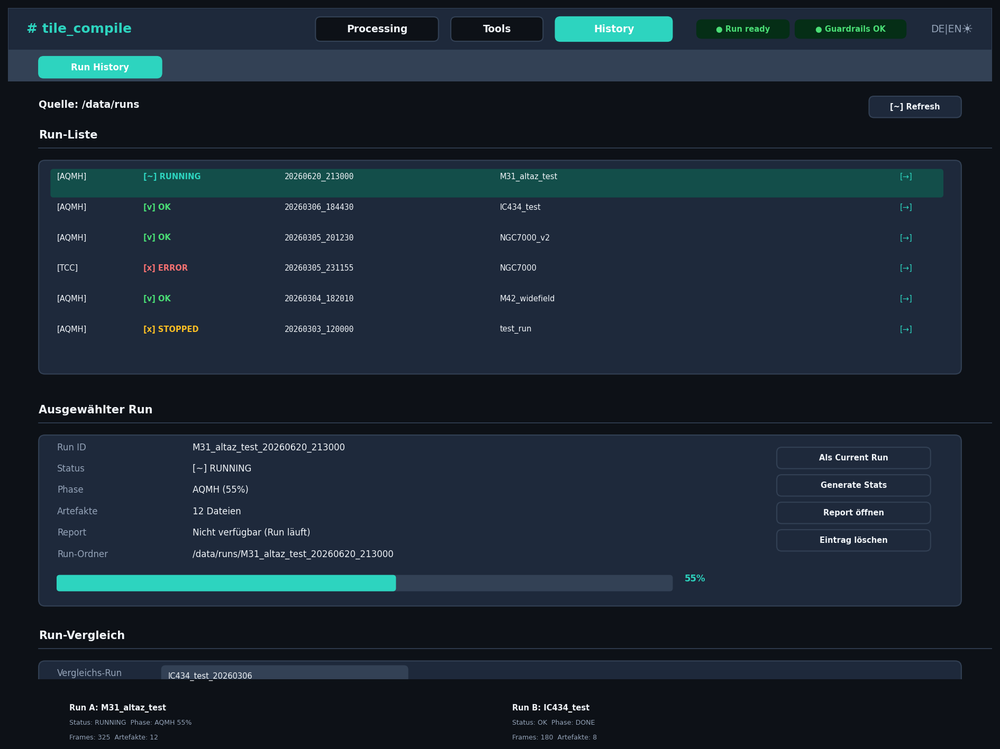

### 9.1 Layout

```
┌─────────────────────────────────────────────────────────────────────┐
│  Run History                                                        │
├─────────────────────────────────────────────────────────────────────┤
│                                                                     │
│  Quelle: /data/runs                          [ 🔄 Refresh ]        │
│                                                                     │
│  ┌─ Run-Liste ────────────────────────────────────────────────────┐│
│  │                                                                ││
│  │  [AQMH]  🔄 RUNNING  20260620_213000  M31_altaz_test    [→]  ││
│  │  [AQMH]  ✅ OK       20260306_184430  IC434_test        [→]  ││
│  │  [AQMH]  ✅ OK       20260305_201230  NGC7000_v2        [→]  ││
│  │  [TCC]   ❌ ERROR    20260305_231155  NGC7000           [→]  ││
│  │  [AQMH]  ✅ OK       20260304_182010  M42_widefield     [→]  ││
│  │  [AQMH]  ⏹ STOPPED   20260303_120000  test_run          [→]  ││
│  │                                                                ││
│  └────────────────────────────────────────────────────────────────┘│
│                                                                     │
│  ┌─ Ausgewählter Run ─────────────────────────────────────────────┐│
│  │                                                                ││
│  │  Run ID       M31_altaz_test_20260620_213000                  ││
│  │  Status       🔄 RUNNING                                       ││
│  │  Phase        AQMH (55%)                                       ││
│  │  Fortschritt  ████████████░░░░░░░░░░  55%                    ││
│  │  Artefakte    12 Dateien                                      ││
│  │  Report       Nicht verfügbar (Run läuft)                     ││
│  │  Run-Ordner   /data/runs/M31_altaz_test_20260620_213000       ││
│  │                                                                ││
│  │  [ Als Current Run ]  [ Generate Stats ]  [ Report öffnen ]   ││
│  │  [ Eintrag löschen ]                                           ││
│  │                                                                ││
│  └────────────────────────────────────────────────────────────────┘│
│                                                                     │
│  ┌─ Run-Vergleich ────────────────────────────────────────────────┐│
│  │                                                                ││
│  │  Vergleichs-Run  [IC434_test_20260306▼]                      ││
│  │                                                                ││
│  │  ┌─ Run A ──────────┐    ┌─ Run B ──────────┐                ││
│  │  │ M31_altaz_test   │    │ IC434_test       │                ││
│  │  │ Status: RUNNING  │    │ Status: OK       │                ││
│  │  │ Phase: AQMH 55%  │    │ Phase: DONE      │                ││
│  │  │ Frames: 325      │    │ Frames: 180      │                ││
│  │  │ Artefakte: 12    │    │ Artefakte: 8     │                ││
│  │  └──────────────────┘    └──────────────────┘                ││
│  │                                                                ││
│  │  [ Current als Vergleich ]  [ Vergleich löschen ]             ││
│  │                                                                ││
│  └────────────────────────────────────────────────────────────────┘│
│                                                                     │
└─────────────────────────────────────────────────────────────────────┘
```

### 9.2 Ablauf

```
User öffnet History Tab → Run History Sub-Tab
    │
    ├── GET /api/runs (Liste laden)
    │
    ├── Run auswählen
    │   ├── GET /api/runs/{runId}/status
    │   ├── GET /api/runs/{runId}/artifacts
    │   └── Details anzeigen
    │
    ├── "Als Current Run" → setzt aktuellen Run für Run Monitor
    │   ├── POST /api/runs/{runId}/set-current
    │   └── Toast: "Run als current gesetzt"
    │
    ├── "Generate Stats" → gleiche Logik wie Run Monitor
    ├── "Report öffnen" → öffnet HTML-Report in neuem Tab
    ├── "Eintrag löschen" → DELETE /api/runs/{runId}/delete (mit Bestätigung)
    │
    └── Vergleichs-Run wählen → Side-by-Side Anzeige
```

---

## 10. Logging-Konzept

### 10.1 Log-Viewer Komponente

```
┌─ Live Log ──────────────────────────────────────────────────────┐
│                                                                │
│  ┌─ Toolbar ─────────────────────────────────────────────────┐ │
│  │  [All▼] [Info✓] [Warning✓] [Error✓] [Debug☐] [Trace☐]   │ │
│  │  [🔍 Suche im Log...]                                     │ │
│  │  [⏸ Pause]  [⬇ Export]  [🗑 Clear]                       │ │
│  └───────────────────────────────────────────────────────────┘ │
│                                                                │
│  ┌─ Log-Liste (virtualisiert) ───────────────────────────────┐ │
│  │                                                            │ │
│  │  21:15:32  INFO    Phase SCAN started                     │ │
│  │  21:15:33  INFO    Found 325 frames in /data/M31          │ │
│  │  21:15:34  INFO    Color mode: OSC, Bayer: RGGB          │ │
│  │  ─────────────────────────────────────────────────────── │ │
│  │  21:15:35  INFO    Phase SCAN completed (3.2s)            │ │
│  │  21:15:35  INFO    Phase CALIBRATION started              │ │
│  │  21:15:47  INFO    Phase CALIBRATION completed (12.4s)    │ │
│  │  ─────────────────────────────────────────────────────── │ │
│  │  21:15:47  INFO    Phase REGISTRATION started             │ │
│  │  21:15:52  WARN ⚠ Frame 47: low CC=0.31, sequential      │ │
│  │  21:16:01  INFO    Frame 112: hot pixel detected, clamped │ │
│  │  21:16:13  INFO    Phase REGISTRATION completed (26.1s)   │ │
│  │  ─────────────────────────────────────────────────────── │ │
│  │  21:16:13  INFO    Phase AQMH started                     │ │
│  │  21:16:58  INFO    AQMH: processing window 180/325        │ │
│  │  21:17:12  WARN ⚠ AQMH: cherry-pick selected 98 frames   │ │
│  │                                                            │ │
│  └────────────────────────────────────────────────────────────┘ │
│  Auto-scroll: AN (neue Zeilen unten)                           │
└────────────────────────────────────────────────────────────────┘
```

### 10.2 Log-Format

Jede Log-Zeile besteht aus:

```
[HH:MM:SS] [LEVEL] [message]
```

| Level | Farbe | Icon |
|---|---|---|
| ERROR | `text-red-500` | ❌ |
| WARN | `text-amber-500` | ⚠ |
| INFO | `text-blue-400` | – |
| DEBUG | `text-gray-500` | – |
| TRACE | `text-gray-700` | – |

### 10.3 Phase-Marker

Phasen-Übergänge werden als visuelle Trennlinie dargestellt:

```
───────────────────────────────────────────────────────────────
  21:15:35  INFO    Phase SCAN completed (3.2s)
───────────────────────────────────────────────────────────────
  21:15:35  INFO    Phase CALIBRATION started
```

### 10.4 Performance

- **Virtualisierung**: Canvas-basiertes Rendering oder `IntersectionObserver`-basierte Zeilen-Wiederverwendung – nur sichtbare Zeilen werden gerendert
- **Max. Zeilen**: 10.000 im Memory, ältere werden abgeschnitten
- **Auto-scroll**: Nur wenn Pause nicht aktiv und User am unteren Ende
- **Search**: Inkrementelle Suche über im Memory befindliche Zeilen
- **Export**: Alle Zeilen (nicht nur gefilterte) als `.txt` herunterladen

---

## 11. Toast-Notifications

### 11.1 Position und Verhalten

```
                                                          
                                                          
  [ Tab-Inhalt ]                                          
                                                          
                                                          
                                          ┌────────────┐ 
                                          │ ✅ Success  │ 
                                          │             │ 
                                          │ [×]         │ 
                                          └────────────┘ 
                                          ┌────────────┐ 
                                          │ ⚠ Warning  │ 
                                          │             │ 
                                          │ [×]         │ 
                                          └────────────┘ 
```

- Position: **unten rechts**
- Stack: neueste oben
- Auto-dismiss: 5s (Success/Info), 10s (Warning), sticky (Error)
- Animation: Slide-in von rechts
- Klick: → Navigation zum relevanten Tab

### 11.2 Toast-Typen

```
┌──────────────────────────────────────┐
│ ✅ Scan completed                    │
│ 325 frames, OSC, RGGB                │
│                              [×]     │
└──────────────────────────────────────┘

┌──────────────────────────────────────┐
│ ⚠ Validation: 2 warnings             │
│ Click to review                       │
│                              [×]     │
└──────────────────────────────────────┘

┌──────────────────────────────────────┐
│ ❌ Run failed                         │
│ Phase: REGISTRATION                   │
│ Error: timeout after 60s              │
│                              [×]     │
└──────────────────────────────────────┘

┌──────────────────────────────────────┐
│ ℹ KI-Analyse verfügbar                │
│ 4 Empfehlungen generiert              │
│ Click to review                       │
│                              [×]     │
└──────────────────────────────────────┘
```

### 11.3 Toast-Events

| Event | Typ | Trigger |
|---|---|---|
| Scan completed | Success | `/api/scan` response |
| Scan failed | Error | `/api/scan` error |
| Validation OK | Success | `/api/config/validate` ok |
| Validation warnings | Warning | `/api/config/validate` warnings |
| Validation errors | Error | `/api/config/validate` errors |
| Config saved | Success | `/api/config/save` ok |
| Run started | Info | `/api/runs/start` ok |
| Run completed | Success | WebSocket: phase=DONE |
| Run failed | Error | WebSocket: phase=ERROR |
| KI analysis ready | Info | `/api/scan/analysis` ok |
| Download completed | Success | Job polling: state=ok |
| Download failed | Error | Job polling: state=error |

---

## 12. Responsive Verhalten

### 12.1 Desktop (>1280px)

- 3-Spalten Layout im Parameter-Tab (Kategorien | Editor | Explain)
- Run Monitor: Phasen + Log + Resume nebeneinander
- Full Feature-Set

### 12.2 Tablet (768-1280px)

- Parameter-Tab: 2-Spalten (Kategorien | Editor), Explain als Drawer/Popover
- Run Monitor: Phasen oben, Log unten, Resume als Tab
- History: Liste + Details gestapelt

### 12.3 Mobile (<768px) – optional, nicht primäres Ziel

- Single-Spalten Layout
- Sub-Tabs als Dropdown
- Log: Full-width
- Parameter: Kategorie-Liste als Drawer

### 12.4 Breakpoints (CSS Media Queries)

```css
sm:  640px   /* Mobile landscape */
md:  768px   /* Tablet portrait */
lg:  1024px  /* Tablet landscape / small desktop */
xl:  1280px  /* Desktop */
2xl: 1536px  /* Large desktop (Default-Target) */
```

**Primäres Target**: `xl` (1280px+) und `2xl` (1536px+)  
**Sekundäres Target**: `lg` (1024px+) mit Layout-Anpassung  
**Nicht-Target**: `<lg` (nicht funktionskritisch)

---

## 13. Dark Mode

### 13.1 Umschaltung

- **Theme-Toggle** (☾/☀ Icon) → Theme: Light / Dark
- Persistiert in `uiStore`
- CSS Custom Properties via `html[data-theme="dark"]` Attribut

### 13.2 Dark Mode Farben

```
Background:    #0f172a  (slate-900)
Surface:       #1e293b  (slate-800)
Border:        #334155  (slate-700)
Foreground:    #f1f5f9  (slate-100)
Muted:         #94a3b8  (slate-400)
Primary:       #2dd4bf  (teal-400)
Primary-soft:  #134e4a  (teal-900)
Success:       #4ade75  (green-400)
Warning:       #fbbf24  (amber-400)
Error:         #f87171  (red-400)
```

### 13.3 Log-Viewer im Dark Mode

```
Background:    #0d1117  (github-dark)
Text:          #e6edf3
INFO:          #58a6ff  (blue)
WARN:          #d29922  (yellow)
ERROR:         #f85149  (red)
DEBUG:         #7d8590  (gray)
Phase-Marker:  #21262d
```
